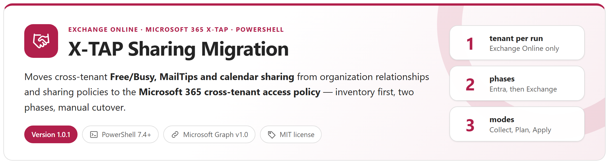
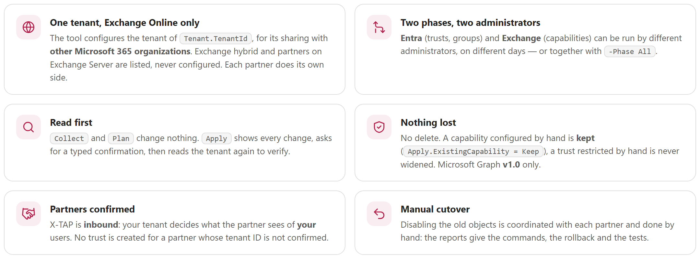
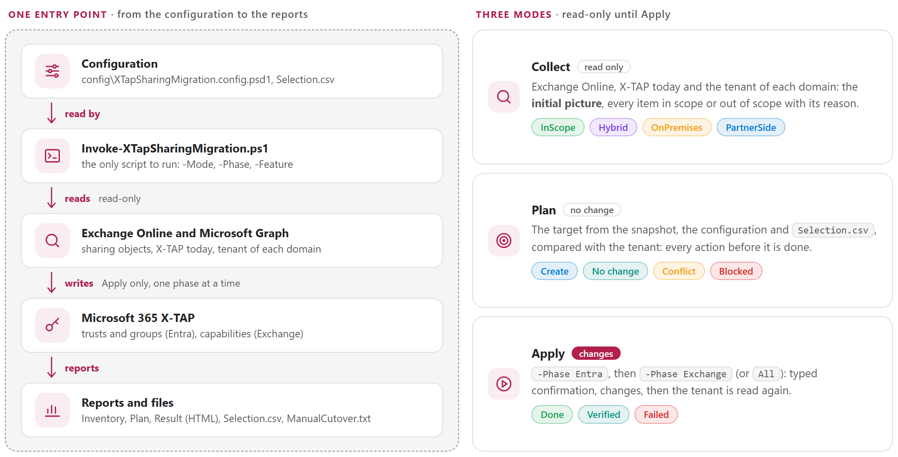
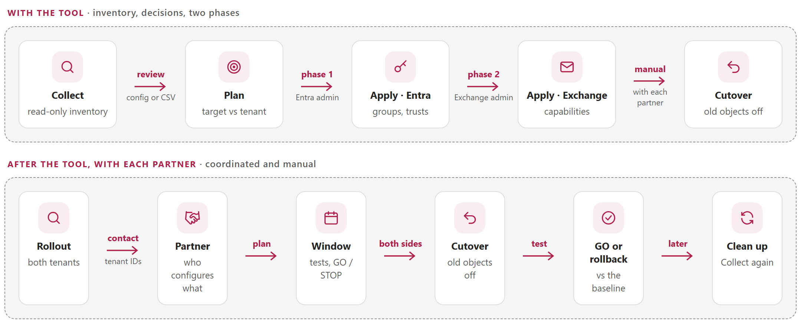
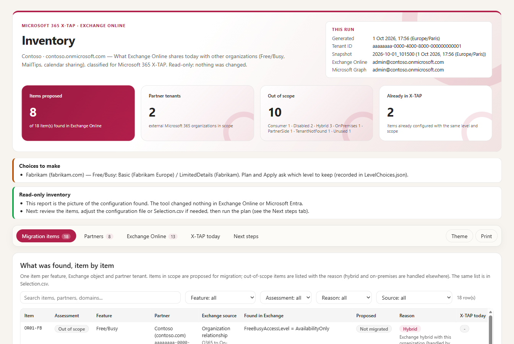
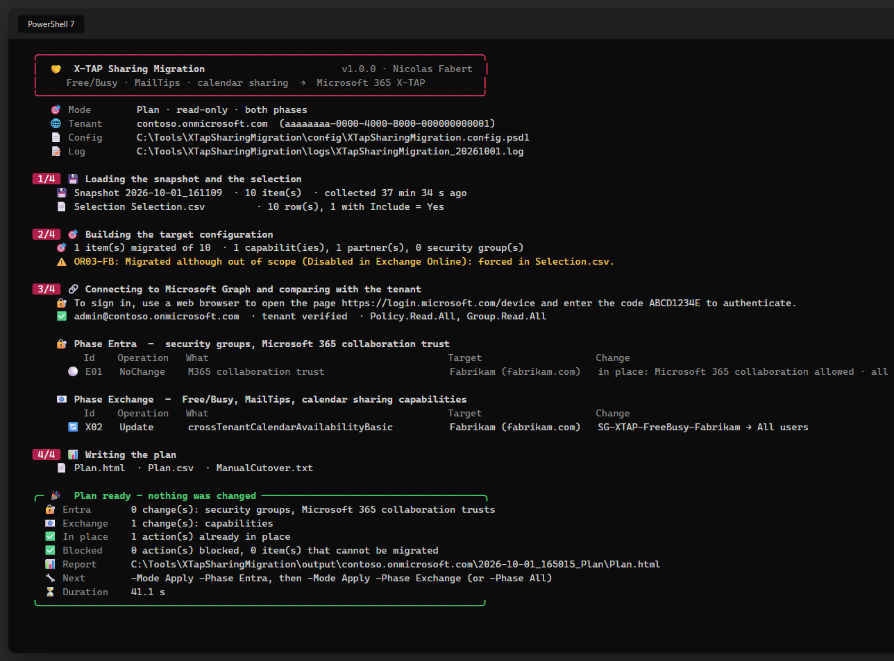
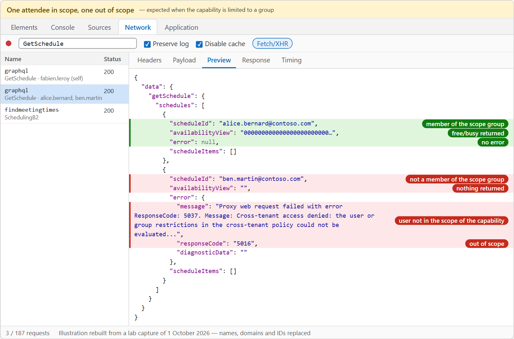

<p align="center">
  <picture>
    <source media="(prefers-color-scheme: dark)" srcset="docs/images/readme-banner-dark.png">
    
  </picture>
</p>

<p align="center">
  <a href="#how-it-works"><b>How it works</b></a> &nbsp;&middot;&nbsp;
  <a href="#what-is-migrated"><b>What is migrated</b></a> &nbsp;&middot;&nbsp;
  <a href="#from-inventory-to-cutover"><b>From inventory to cutover</b></a> &nbsp;&middot;&nbsp;
  <a href="#reports"><b>Reports</b></a> &nbsp;&middot;&nbsp;
  <a href="#quick-start"><b>Quick start</b></a> &nbsp;&middot;&nbsp;
  <a href="docs/XTapSharingMigration-Guide.md"><b>Administrator guide</b></a>
</p>

## Why

Sharing Free/Busy, MailTips and calendars with another Microsoft 365 organization through an **organization relationship** or a **sharing policy** relies on **Exchange Web Services**, which is being retired in Exchange Online. Microsoft replaces these objects with the **Microsoft 365 cross-tenant access policy (X-TAP)** and documents the migration ([Migrate to Microsoft 365 Cross-Tenant Access Policy](https://learn.microsoft.com/exchange/sharing/migrate-to-m365-xtap)). In a real tenant the hard part is not the commands, it is the **inventory** — which relationships belong to the Exchange hybrid, which partner hides behind which domain, which sharing policy applies to which mailboxes — and a written trace of every decision. This tool does that part, for **one tenant**, in **two phases** that different administrators can run.

<picture>
  <source media="(prefers-color-scheme: dark)" srcset="docs/images/readme-principles-dark.png">
  
</picture>

## How it works

<picture>
  <source media="(prefers-color-scheme: dark)" srcset="docs/images/readme-how-it-works-dark.png">
  
</picture>

`Collect` keeps the **initial picture** of the tenant in `snapshot.json` and `Inventory.html`; `Plan` and `Apply` work from it. `Apply -Phase Entra` creates the security groups and the Microsoft 365 collaboration trust of each partner (Security / Groups Administrator), `Apply -Phase Exchange` the Free/Busy, MailTips and calendar sharing capabilities (Exchange Administrator) — or both with `-Phase All`. Every Apply starts with the same comparison as Plan and ends by reading the tenant again: what is in place shows **No change**. Microsoft Graph **v1.0** only.

## What is migrated

| Exchange Online | Microsoft 365 X-TAP |
|---|---|
| Organization relationship — `FreeBusyAccessLevel` `AvailabilityOnly` / `LimitedDetails` | `crossTenantCalendarAvailabilityBasic` / `…LimitedDetails`, partner policy |
| Organization relationship — `MailTipsAccessLevel` `Limited` / `All` | `crossTenantMailTipsLimited` / `…All`, partner policy |
| Scope groups of the relationship | the same groups (Entra object ID) as the scope of the capability |
| Sharing policy — `<domain>:` / `*:` / `Anonymous:CalendarSharingFreeBusy*` | `crossTenantCalendarSharingFreeBusy*` in the partner / default policy, `anonymousCalendarSharingFreeBusy*` |
| Availability address space (`OrgWideFBToken`) | configured **by the partner** for your tenant ID — listed for coordination |

- **One configuration per partner tenant**: 25 relationships and 40 domains of 12 tenants give 12 partner policies. When Exchange gives several levels for the same partner and users, **the administrator chooses** (asked once, recorded).
- **Partner tenant IDs** are found from the domains and must be **confirmed by the partner** before any trust is created (`PartnersToConfirm.txt`).
- **Out of scope, never configured, cannot be forced**: Exchange **hybrid** with your own on-premises servers (dedicated Exchange hybrid application) and partners on **Exchange Server**. They appear in the inventory with the reason.
- **Forced by the configuration** when needed: a level, a scope (all users, a security group, a dynamic group created by the tool), a partner excluded — or item by item in **`Selection.csv`**.

## From inventory to cutover

<picture>
  <source media="(prefers-color-scheme: dark)" srcset="docs/images/readme-runbook-dark.png">
  
</picture>

- **One feature at a time**: `-Feature FreeBusy, MailTips` limits Plan and Apply to some features — calendar sharing reaches the tenants after Free/Busy and MailTips.
- **The cutover stays manual** and coordinated with each partner: X-TAP is configured but not used until the old objects are disabled on **both** sides. The reports give the commands, the rollback and the cleanup (`ManualCutover.txt`); the guide gives the partner message, the change window, the test matrix and the **GO / STOP** criteria.
- **Troubleshooting in the browser**: what the developer tools show for Free/Busy, MailTips and calendar sharing — expected or not — from real captures (guide, chapter 11).

## Reports

<table>
  <tr>
    <td width="50%" valign="top"><a href="docs/images/report-inventory.png"></a><br><sub><b>Inventory</b> &middot; the initial picture: every item, in scope or out of scope with its reason</sub></td>
    <td width="50%" valign="top"><a href="docs/images/report-plan.png"></a><br><sub><b>Plan / Result</b> &middot; the actions of both phases, before and after, verified</sub></td>
  </tr>
  <tr>
    <td width="50%" valign="top"><a href="docs/images/console-plan.png"></a><br><sub><b>Console</b> &middot; banner, steps, one table per phase, summary card</sub></td>
    <td width="50%" valign="top"><a href="docs/images/devtools-freebusy-scope.png"></a><br><sub><b>After the cutover</b> &middot; the GetSchedule call in the developer tools: in scope, out of scope</sub></td>
  </tr>
</table>

Every report is a self-contained HTML file — light and dark themes, search and filters, details on click — next to `Selection.csv`, `PartnersToConfirm.txt`, `ManualCutover.txt`, the CSV of the actions and a daily log.

## Requirements

| Item | Requirement |
|---|---|
| PowerShell | 7.4 or later |
| Modules | `Microsoft.Graph.Authentication` 2.25+, `ExchangeOnlineManagement` 3.9+ |
| Collect | Exchange role that can read the configuration; Graph `Policy.Read.All`, `CrossTenantInformation.ReadBasic.All`, `Group.Read.All` |
| Phase Entra | Security Administrator (+ Groups Administrator) or Global Administrator |
| Phase Exchange | Exchange Administrator or Global Administrator |

## Quick start

```powershell
git clone https://github.com/Nico77600/XTapSharingMigration.git
cd XTapSharingMigration
notepad .\config\XTapSharingMigration.config.psd1          # Tenant.TenantId, Tenant.Organization

.\Invoke-XTapSharingMigration.ps1                           # inventory (read-only)
.\Invoke-XTapSharingMigration.ps1 -Mode Plan                # what would be configured (read-only)
.\Invoke-XTapSharingMigration.ps1 -Mode Apply -Phase Entra     # groups and trusts
.\Invoke-XTapSharingMigration.ps1 -Mode Apply -Phase Exchange  # Free/Busy, MailTips, calendar sharing
.\Invoke-XTapSharingMigration.ps1 -Mode Plan -Feature FreeBusy, MailTips   # only some features
```

The zip of each [release](https://github.com/Nico77600/XTapSharingMigration/releases) contains only the files needed to run, with the HTML guide.

## Documentation

The **administrator guide** covers the principles, what is in scope, the partner tenant ID confirmation, the configuration rules, `Selection.csv`, the reports, **what to do after the script** (rollout check, partner contact, change window, cutover, test matrix, browser developer tools, rollback, cleanup), troubleshooting and the internals:

- [docs/XTapSharingMigration-Guide.md](docs/XTapSharingMigration-Guide.md)
- `docs/XTapSharingMigration-Guide.html` — the same guide as a single HTML file (download it and open it locally)

## Tests

```powershell
Invoke-Pester -Path .\tests          # Pester 5+, simulated tenant, no connection to Microsoft 365
.\tests\New-DemoReports.ps1          # the three HTML reports from the simulated tenant
```

`tools\Build-Documentation.ps1` rebuilds the HTML guide; `tools\New-ReadmeImages.ps1` renders the graphics of this page from the cards and flows of the guide, in a light and a dark version.

## License

[MIT](LICENSE)

## Disclaimer

Personal project, provided as is. It is not an official Microsoft product and is not supported by Microsoft. Test it in your environment before production use, and coordinate every cutover with the partner organizations.