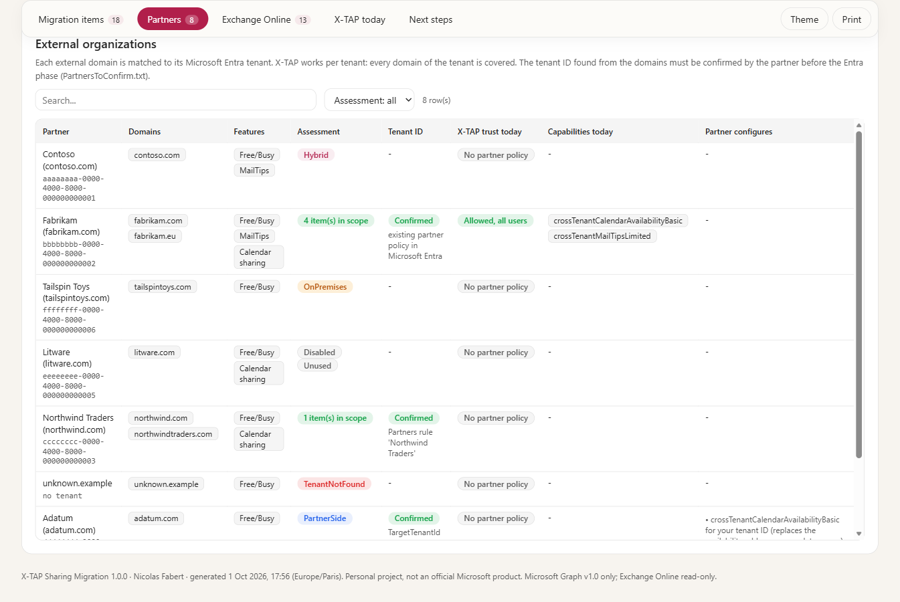
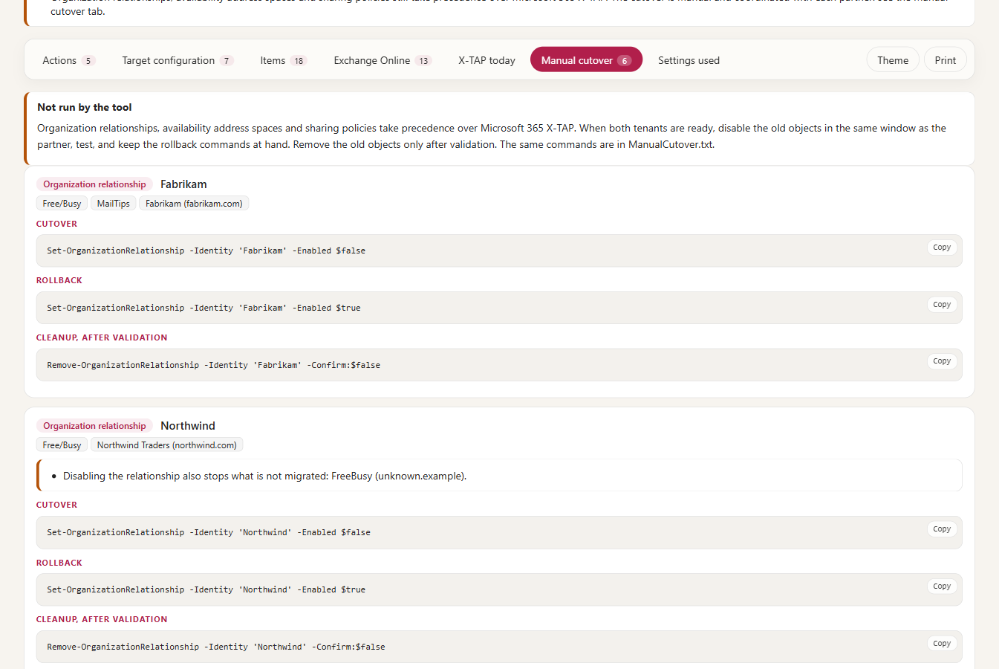
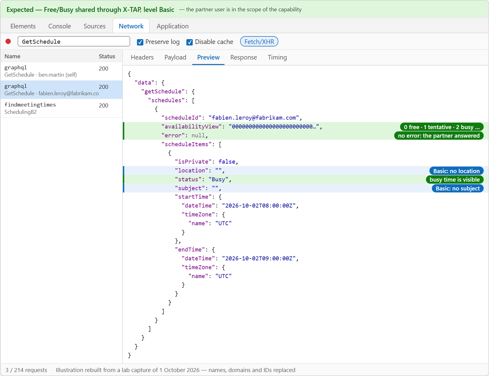
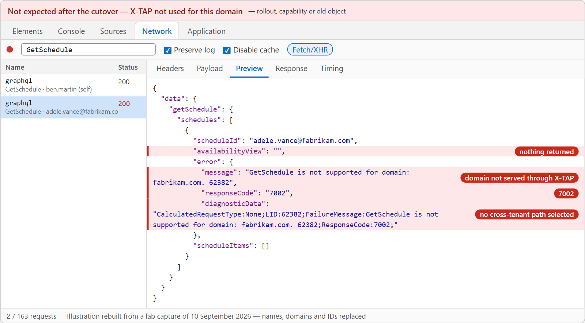
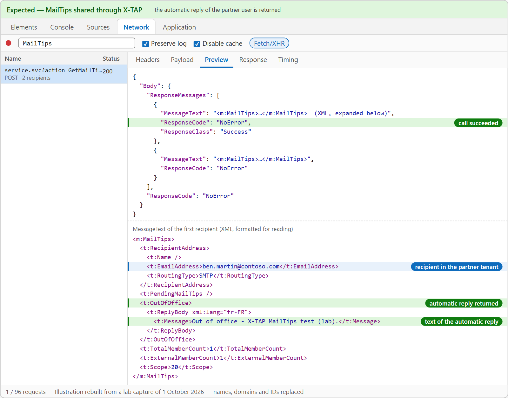
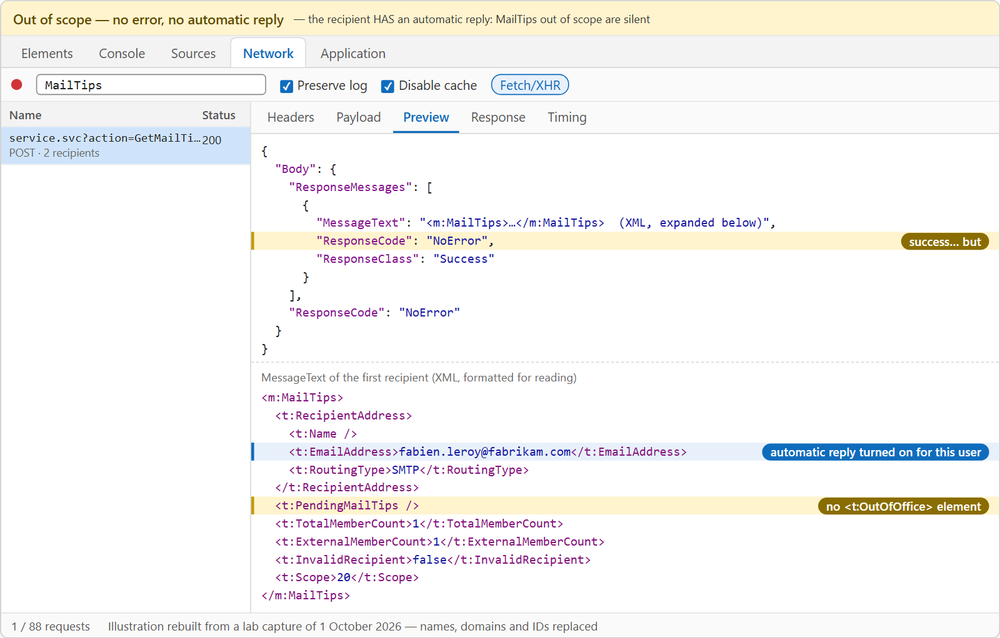
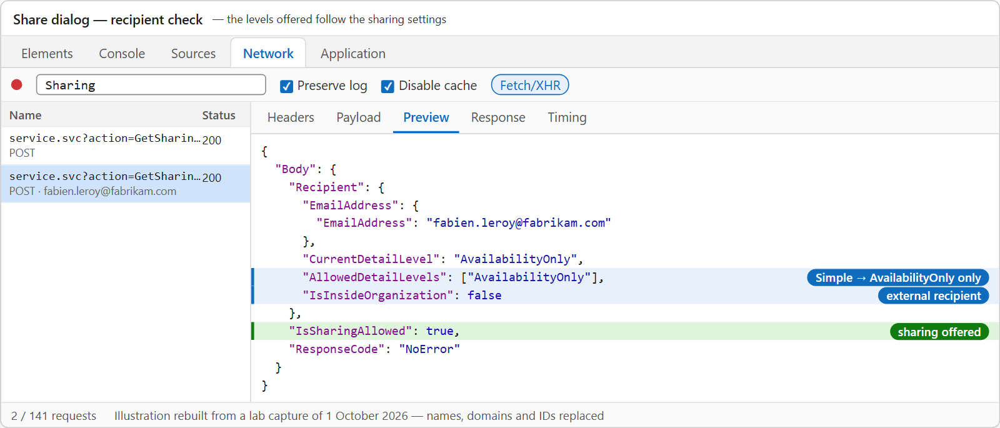
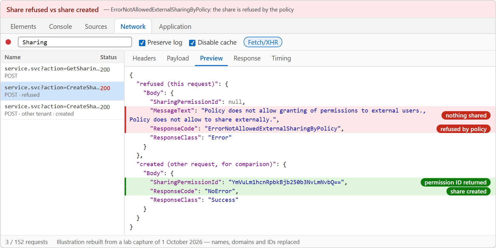

# X-TAP Sharing Migration — Administrator guide

> Moves cross-tenant **Free/Busy, MailTips and calendar sharing** from Exchange Online organization relationships, sharing policies and availability address spaces to the **Microsoft 365 cross-tenant access policy (X-TAP)** — for **one tenant**, in **two phases** that different administrators can run.

```cards
search | What it reads | The Exchange Online sharing configuration and the current Microsoft 365 X-TAP of the tenant — **read-only**.
target | What it decides | Which items move to X-TAP, at which level and for whom: proposed automatically, forced by the configuration or chosen in a CSV file.
key | What it changes | Phase **Entra**: security groups and the Microsoft 365 collaboration trust. Phase **Exchange**: the capabilities.
file | What it leaves you | An HTML report for each run — inventory, plan, result — and the **manual cutover** commands with their rollback.
```

## Quick start

```steps
Collect | `.\Invoke-XTapSharingMigration.ps1` — read-only inventory: `Inventory.html`, `Selection.csv`, `PartnersToConfirm.txt`.
Confirm the partners | Exchange tenant IDs with each partner and paste the `Partners` entries in the configuration.
Plan | `.\Invoke-XTapSharingMigration.ps1 -Mode Plan` — what would be configured, compared with the tenant. Nothing changes.
Apply, phase Entra | `-Mode Apply -Phase Entra` — groups and trusts (Security / Groups Administrator).
Apply, phase Exchange | `-Mode Apply -Phase Exchange` — Free/Busy, MailTips, calendar sharing (Exchange Administrator). Two administrators: the same Collect folder for both phases (chapter 8).
Cut over with each partner | Manual: contact the partner, plan the window, disable the old objects with the commands of the reports, test — chapter 11.
```

> [!IMPORTANT]
> The tool **never changes an Exchange Online object** and **never deletes** anything. Organization relationships, sharing policies and availability address spaces keep working — and keep taking precedence over X-TAP — until you run the cutover commands yourself, in a window agreed with each partner.

# Part I · Understand

<!-- icon: book -->
## 1. Why this tool

Sharing Free/Busy, MailTips and calendars with another Microsoft 365 organization through an **organization relationship** or a **sharing policy** relies on **Exchange Web Services (EWS)**, which is being retired in Exchange Online. Microsoft replaces these objects with the **Microsoft 365 cross-tenant access policy** (X-TAP): an Entra trust per partner tenant, plus **capabilities** that say what the partner can see, and for which users.

Microsoft documents the migration step by step ([Migrate to Microsoft 365 Cross-Tenant Access Policy](https://learn.microsoft.com/exchange/sharing/migrate-to-m365-xtap)). In a real tenant the hard part is not the commands, it is the **inventory**: which relationships are still used, which belong to the Exchange hybrid configuration, which partner hides behind which domain, which sharing policy is assigned to which mailboxes. This tool automates that part and keeps a written trace of every decision.

**Design principles**

```cards
globe | One tenant, Exchange Online only | The tool configures the tenant of `Tenant.TenantId`, for its sharing with **other Microsoft 365 organizations**. Exchange hybrid and partners on Exchange Server are listed, never configured. Each partner does its own side.
split | Two phases, two administrators | **Entra** (trusts, groups) and **Exchange** (capabilities) can be run by different administrators, on different days — or together with `-Phase All`.
search | Read first | `Collect` and `Plan` change nothing. `Apply` shows every change, asks for a typed confirmation, then reads the tenant again to verify.
shield | Nothing lost | No delete. A capability configured by hand is **kept** (`Apply.ExistingCapability = Keep`), a trust restricted by hand is never widened. Microsoft Graph **v1.0** only.
handshake | Partners confirmed | X-TAP is **inbound**: your tenant decides what the partner sees of **your** users. No trust is created for a partner whose tenant ID is not confirmed.
undo | Manual cutover | Disabling the old objects is coordinated with each partner and done by hand: the reports give the commands, the rollback and the tests.
```
<!-- icon: flow -->
## 2. How it works

```flow
settings | Configuration | config\XTapSharingMigration.config.psd1, Selection.csv
arrow | read by |
terminal | Invoke-XTapSharingMigration.ps1 | the only script to run: -Mode, -Phase, -Feature
arrow | reads | read-only
search | Exchange Online and Microsoft Graph | sharing objects, X-TAP today, tenant of each domain
arrow | writes | Apply only, one phase at a time
key | Microsoft 365 X-TAP | trusts and groups (Entra), capabilities (Exchange)
arrow | reports |
chart | Reports and files | Inventory, Plan, Result (HTML), Selection.csv, ManualCutover.txt
```

From the first inventory to the cutover:

```flow
search | Collect | read-only inventory
arrow | review | config or CSV
target | Plan | target vs tenant
arrow | phase 1 | Entra admin
key | Apply · Entra | groups, trusts
arrow | phase 2 | Exchange admin
mail | Apply · Exchange | capabilities
arrow | manual | with each partner
undo | Cutover | old objects off
```

| Mode | Reads | Writes in the tenant | Files |
|---|---|---|---|
| **Collect** | Exchange Online (organization relationships, availability address spaces, sharing policies, mailboxes per sharing policy, hybrid objects); Microsoft 365 X-TAP; tenant of each external domain | nothing | `Inventory.html`, `snapshot.json`, `Selection.csv`, `PartnersToConfirm.txt`, `SharingPolicyMailboxes.csv`, `backup\*.xml` |
| **Plan** | the snapshot, the configuration, `Selection.csv`; Microsoft 365 X-TAP and groups | nothing | `Plan.html`, `Plan.csv`, `ManualCutover.txt` |
| **Apply -Phase Entra** | same as Plan | security groups (create, add members); Microsoft 365 collaboration trust of each partner | `Result.html`, `Result.csv`, `ManualCutover.txt` |
| **Apply -Phase Exchange** | same as Plan | Microsoft 365 capabilities in the partner policies and the default policy | same |

Every run writes into `output\<tenant>\<date>_<mode>`. Plan and Apply use the most recent Collect of the tenant unless `-SnapshotPath` is given.


<!-- icon: split -->
## 3. What is migrated — and what is not

### From Exchange Online to X-TAP

| Exchange Online | Found as | Microsoft 365 X-TAP capability | Policy |
|---|---|---|---|
| Organization relationship | `FreeBusyAccessLevel` `AvailabilityOnly` | `crossTenantCalendarAvailabilityBasic` | partner |
| | `FreeBusyAccessLevel` `LimitedDetails` | `crossTenantCalendarAvailabilityLimitedDetails` | partner |
| | `MailTipsAccessLevel` `Limited` / `All` | `crossTenantMailTipsLimited` / `crossTenantMailTipsAll` | partner |
| | `FreeBusyAccessScope`, `MailTipsAccessScope` | the scope group (Entra object ID) | |
| Availability address space | `OrgWideFBToken` | `crossTenantCalendarAvailabilityBasic` **in the partner's tenant**, for your tenant ID (see below) | — |
| Sharing policy | `<domain>:CalendarSharingFreeBusy*` | `crossTenantCalendarSharingFreeBusy*` | partner |
| | `*:CalendarSharingFreeBusy*` | `crossTenantCalendarSharingFreeBusy*` | default |
| | `Anonymous:CalendarSharingFreeBusy*` | `anonymousCalendarSharingFreeBusy*` | default |

`*` = `Simple` (time only), `Detail` (subject and location) or `Reviewer` (all details), the same level on both sides.

**Direction.** An organization relationship and a sharing policy say what the partner sees of **your** users: they become **inbound** capabilities in **your** tenant. An **availability address space** is the other way round: it lets **your** users read the free/busy **of the partner**. Its X-TAP equivalent is configured **by the partner**, in its own tenant, for your tenant ID. The tool therefore classifies it **PartnerSide**: nothing is configured in your tenant (unless you force it, when the partner must also see your users), the partner appears in the coordination list with what it must configure, and the address space is removed in the cutover once the partner is ready. Its `TargetTenantId` still confirms the partner's tenant ID. Microsoft notes that an `OrgWideFBToken` address space does not depend on EWS: moving it to X-TAP is recommended (finer scopes, Entra governance), not required by the EWS retirement.

Each **item** of the inventory is one feature of one Exchange object for one partner tenant: for example `OR02-FB` is the Free/Busy of the second organization relationship, `SP01-03` the third entry of the first sharing policy. When a relationship lists domains of two tenants, it gives one item per tenant (`OR05-FB-1`, `OR05-FB-2`).

### In scope, out of scope

> [!IMPORTANT]
> **Two cases are outside this migration, whatever the configuration or `Selection.csv` says:**
>
> - **Exchange hybrid** — Free/Busy, MailTips and calendar sharing between **your** Exchange Online and **your** on-premises Exchange servers. They move with the **dedicated Exchange hybrid application**, not with X-TAP.
> - **Partners on Exchange Server** — an organization relationship (or an availability address space) whose partner endpoint is an on-premises Exchange (`https://mail.partner.com/ews/exchange.asmx`, an on-premises autodiscover …), and the partner's relationship pointing to you. Microsoft lists sharing with an on-premises organization as **not impacted** today (changes announced later in Message Center).
>
> The tool reads these objects, shows them as **Hybrid** or **OnPremises** with the reason, and leaves them as they are: no capability, no trust, no cutover command. They are checked **before** everything else — a disabled or unused hybrid / on-premises object is still reported as Hybrid / OnPremises.

| Reason | Meaning | Can be forced in `Selection.csv` |
|---|---|---|
| **InScope** | External Microsoft 365 tenant | — |
| **Hybrid** | Exchange hybrid with your own on-premises organization: relationship `O365 to On-premises - …`, relationship of an on-premises organization (`Get-OnPremisesOrganization`), one of your accepted domains, `InternalProxy` address space. **Out of scope** — dedicated Exchange hybrid application. | **no** |
| **SameTenant** | Domain of this tenant | no |
| **OnPremises** | Partner on Exchange Server: the partner endpoint (`TargetSharingEpr`, `TargetAutodiscoverEpr`, `TargetApplicationUri` of a relationship, `TargetAutodiscoverEpr` / `TargetServiceEpr` of an address space) is not an Exchange Online host (`Collection.Microsoft365Endpoints`). **Out of scope** — not part of this migration. | **no** |
| **Disabled** | Disabled in Exchange Online | yes |
| **Unused** | Sharing policy assigned to no mailbox | yes |
| **TenantNotFound** | No Microsoft Entra tenant for this domain | no |
| **Consumer** | Consumer accounts (Outlook.com …) | no |
| **ResolutionError** | The tenant of the domain could not be found (network …) — collect again | no |
| **NotMigratable** | No X-TAP equivalent: address space other than `OrgWideFBToken`, sharing entry without calendar action | no |
| **PartnerSide** | Availability address space: your users read the partner's free/busy; the partner configures the X-TAP equivalent for your tenant ID | yes (when the partner must also see your users) |

> [!NOTE]
> A partner with mailboxes **both** on Exchange Server and in Exchange Online: Microsoft notes that sharing with its **Exchange Online** part is impacted. When your relationship points to its on-premises endpoint, the tool reports it as **OnPremises** and does not migrate it: treat it as a separate case with the partner. A relationship **without** endpoint, whose domains belong to a Microsoft 365 tenant, is in scope, with a note.

> [!NOTE]
> Other uses of an organization relationship — mailbox moves, archive access, delivery reports, photos — are **not** migrated. The inventory says so on the item, and the cutover commands warn before disabling such a relationship.

### Several sharing policies

When more than one sharing policy is assigned to mailboxes, the users of each policy must keep their own level. Microsoft's answer is a **security group per policy**: the tool proposes the scope `SharingPolicy:<name>`, and the Entra phase creates an assigned group `SG-XTAP-SharingPolicy-<name>` with the mailboxes found at collection time (members are added on later runs, never removed). If you prefer `All` or a dynamic group, force the scope in the configuration.

<!-- icon: globe -->
## 4. Partner tenants and their tenant ID

X-TAP identifies a partner by its **tenant ID**, not by its domains: every domain of the tenant is covered. The tool finds the tenant ID of each external domain from the public Microsoft Entra sign-in metadata (`login.microsoftonline.com/<domain>/v2.0/.well-known/openid-configuration`) and groups the domains by tenant. The partner name comes from Microsoft Graph (`findTenantInformationByDomainName`) when the permission is granted.

A tenant ID found from a domain is **not trusted on its own**. With `Entra.RequireConfirmedPartners = $true` (default), the Entra phase creates a trust only when the tenant ID is confirmed by one of these sources:

| Source | How |
|---|---|
| The partner | A `Partners` entry with `TenantId` — the value given by the partner's administrator. If a domain of the entry belongs to **another** tenant, the partner is blocked (**Mismatch**). |
| An availability address space | Its `TargetTenantId` was typed by an administrator. |
| Microsoft Entra | A partner policy already exists for this tenant ID. |

`Collect` writes **PartnersToConfirm.txt**: one line per partner, with the tenant ID found and your own tenant ID, ready to send and to paste in the configuration.

**Several relationships, several domains, one tenant.** Organization relationships list domains; X-TAP lists tenants. Whatever the number of relationships, domains or sharing policy entries that point to the same tenant, the target has **one** partner policy, **one** Microsoft 365 collaboration trust, **one** capability per feature and level, and **one** line to confirm:

| Exchange Online | Microsoft 365 X-TAP |
|---|---|
| 25 relationships, 40 domains, 12 tenants | 12 partner policies |
| 10 domains of one tenant, in one or several relationships | 1 partner policy; its capabilities list every item they replace |
| Same feature, different scopes in two relationships | 1 capability, the scopes added (All wins over a group, with a warning) |
| Same feature, different levels (`AvailabilityOnly` and `LimitedDetails`) for the same users | **the administrator chooses** one level (chapter 8) — one capability |
| One relationship with domains of two tenants | 2 items (`-1`, `-2`), 2 partner policies |

Each domain is looked up once, even when it appears in several objects.

```powershell
Partners = @(
    @{ Name = 'Fabrikam'; Match = 'fabrikam.com'; TenantId = 'bbbbbbbb-0000-4000-8000-000000000002' }
)
```

> [!TIP]
> The exchange of tenant IDs is also the moment to agree on the **cutover window**: X-TAP is inbound, so each partner configures access for **your** tenant ID on its side, and both of you disable the old objects at the same time.



# Part II · Set up

<!-- icon: checklist -->
## 5. Prerequisites

### Workstation

| Item | Requirement |
|---|---|
| PowerShell | **7.4** or later |
| Modules | `Microsoft.Graph.Authentication` 2.25 or later, `ExchangeOnlineManagement` 3.9 or later (not 3.10.0 in certificate mode). `ExchangeOnlineManagement` is used by **Collect** only: an administrator who runs only Plan or Apply — the Entra administrator, typically — needs just `Microsoft.Graph.Authentication`. |
| Console | Windows Terminal (colours and icons); any PowerShell console works |
| Network | `graph.microsoft.com`, `login.microsoftonline.com`, `outlook.office365.com` |

```powershell
Install-Module Microsoft.Graph.Authentication -Scope CurrentUser
Install-Module ExchangeOnlineManagement -MinimumVersion 3.10.1 -Scope CurrentUser
```

### Roles and permissions

| Run | Microsoft Entra / Exchange role | Delegated Microsoft Graph permissions |
|---|---|---|
| `Collect` | Exchange: a role that can run the `Get-` cmdlets (View-Only Organization Management, Global Reader, Exchange Administrator) | `Policy.Read.All`, `CrossTenantInformation.ReadBasic.All`, `Group.Read.All` |
| `Plan` | any of the roles below, read-only use | `Policy.Read.All`, `Group.Read.All` |
| `Apply -Phase Entra` | **Security Administrator** (least-privileged role of the Graph API for partner policies) or Global Administrator, and **Groups Administrator** when groups are created | `Policy.ReadWrite.CrossTenantAccess`, `Group.ReadWrite.All` (or `Group.Read.All` when no group is created) |
| `Apply -Phase Exchange` | **Exchange Administrator** (supported for Free/Busy, MailTips and calendar sharing) or Global Administrator | `Policy.ReadWrite.CrossTenantCapability`, `Group.Read.All` |

The first sign-in asks for consent to these permissions for the **Microsoft Graph Command Line Tools** application (or your own application, `Authentication.GraphClientId`).

> [!NOTE]
> Microsoft's migration guide asks for a Global Administrator for the trust. The Graph API reference lists Security Administrator as enough for partner policies; the Microsoft 365 capabilities accept Exchange Administrator for Free/Busy, MailTips and calendar sharing. The lab validation of 1.0.0 used a Global Administrator.

<!-- icon: download -->
## 6. Installation

```powershell
git clone https://github.com/Nico77600/XTapSharingMigration.git
cd XTapSharingMigration
notepad .\config\XTapSharingMigration.config.psd1    # Tenant.TenantId, Tenant.Organization
.\Invoke-XTapSharingMigration.ps1                     # first inventory
```

Or download the zip of a [release](https://github.com/Nico77600/XTapSharingMigration/releases): it contains only the files needed to run.

| Folder | Content |
|---|---|
| `config\` | the configuration file |
| `src\` | the module code, one file per stage |
| `templates\` | the HTML report template |
| `docs\` | this guide (Markdown and HTML) |
| `tests\` | Pester tests, simulated tenant, demo reports |
| `output\`, `logs\` | created at run time — never commit them (tenant data) |

<!-- icon: settings -->
## 7. Configuration

Everything is in `config\XTapSharingMigration.config.psd1`, a PowerShell data file with comments. All errors are reported together when the tool starts.

### Tenant and authentication

| Setting | Use |
|---|---|
| `Tenant.TenantId` | The tenant to configure. Checked after every sign-in: the tool stops if it is connected to another tenant. |
| `Tenant.Organization` | `xxx.onmicrosoft.com`. Required in certificate mode; used for the output folder name. |
| `Authentication.Mode` | `Interactive` (browser, MFA), `DeviceCode` (code on another device), `Certificate` (app-only, Annex C). |
| `Authentication.ExchangeAdmin` | Account expected for Collect, Plan (`-Phase All` or `Exchange`) and `Apply -Phase Exchange` (`''` = any account of the tenant). |
| `Authentication.EntraAdmin` | Account expected for `-Phase Entra` (Plan and Apply) and `Apply -Phase All` (`''` = the `ExchangeAdmin` account). `-UserPrincipalName` overrides both. The tool stops if another account signs in. |
| `Authentication.DisableWAM` | `$true`: sign in with the browser instead of the Windows broker. Keep it. |
| `Authentication.GraphClientId` | Your own app registration for delegated Graph access; `''` = Microsoft Graph Command Line Tools. |

### What to migrate — rules and their order

For each item, the tool decides **Include**, **Level** and **Scope**, in this order — the first source that gives a value wins:

```steps
-Feature | Plan and Apply only: a feature not listed is **not migrated in this run**, whatever the other rules say (chapter 8).
Selection.csv | When `-SelectionPath` is given: the row of the item (`Include`, `Level`, `Scope`). A row deleted from the file is not migrated.
Partners rule | The `Partners` entry of the partner (matched by tenant ID or by one of its domains).
Features rule | `Features.<feature>.Level` / `.Scope` when different from `AsDiscovered`; `Migrate = $false` excludes the feature.
Administrator choice, then Exchange Online | The level and scope found in the organization relationship or the sharing policy. When Exchange gives several levels for the same partner and users, the level chosen by the administrator (chapter 8).
```

**Features** — for every partner:

```powershell
Features = @{
    FreeBusy                 = @{ Migrate = $true; Level = 'Basic';        Scope = 'AsDiscovered' }   # force time-only Free/Busy
    MailTips                 = @{ Migrate = $true; Level = 'AsDiscovered'; Scope = 'Group:MailTips' } # one group for every partner
    CalendarSharing          = @{ Migrate = $true; Level = 'AsDiscovered'; Scope = 'AsDiscovered' }
    AnonymousCalendarSharing = @{ Migrate = $false }                                                     # keep published calendars on Exchange
}
```

| Feature | Levels |
|---|---|
| `FreeBusy` | `Basic` (time only) · `LimitedDetails` (with subject and location) |
| `MailTips` | `Limited` · `All` |
| `CalendarSharing` | `Simple` · `Detail` · `Reviewer` |
| `AnonymousCalendarSharing` | `Simple` · `Detail` · `Reviewer` |

**Scope values** — in `Features`, `Partners` and `Selection.csv`:

| Value | Meaning |
|---|---|
| `All` | every user of the tenant |
| `<object ID>` | an existing Microsoft Entra security group |
| `Group:<key>` | a group of the `Groups` section (created by the Entra phase when `Create = $true`) |
| `Group:<display name>` | an existing security group, by name (must be unique) |
| `SharingPolicy:<name>` | the assigned group of the mailboxes of a sharing policy (chapter 3) |
| `A \| B` | several values: the capability includes them all |

**Partners** — rules for one partner tenant, on top of its tenant ID confirmation (chapter 4):

```powershell
Partners = @(
    @{ Name = 'Fabrikam'; Match = 'fabrikam.com'; TenantId = 'bbbbbbbb-0000-4000-8000-000000000002'
       FreeBusy = @{ Level = 'LimitedDetails'; Scope = 'Group:FreeBusy-Fabrikam' }
       MailTips = @{ Migrate = $false } }
    @{ Match = 'tailspintoys.com'; Include = $false }     # excluded partner
)
```

**Groups** — security groups referenced as `Group:<key>`:

```powershell
Groups = @{
    'FreeBusy-Fabrikam' = @{
        DisplayName    = 'SG-XTAP-FreeBusy-Fabrikam'
        Description    = 'Users whose free/busy Fabrikam can see'
        Create         = $true
        MembershipRule = '(user.accountEnabled -eq true) and (user.userType -eq "Member") and (user.mail -endsWith "@contoso.com")'
    }
    'Sales' = @{ Id = '11111111-2222-3333-4444-555555555555' }   # existing group
}
```

> [!NOTE]
> A dynamic group needs Microsoft Entra ID P1 for the users it covers. Its members appear after Entra has processed the rule (minutes to hours): check the group before the cutover.

### Changes

| Setting | Default | Effect |
|---|---|---|
| `Entra.RequireConfirmedPartners` | `$true` | No trust for a partner whose tenant ID is not confirmed (chapter 4). |
| `Entra.ReplaceRestrictedTrust` | `$false` | A trust that is **blocked**, or restricted to some users of the partner, is reported and never changed — unless `$true` (then: allowed for all users of the partner). |
| `Apply.ExistingCapability` | `Keep` | The capability already exists with another scope (or is not allowed): `Keep` = reported as a conflict, not changed · `Merge` = the target scope is **added** (nobody loses access) · `Replace` = the scope is replaced. |
| `Apply.DisableOtherLevels` | `$false` | Another level of the same feature already allowed in the same policy is set to not allowed (never deleted). |
| `SharingPolicyGroups.Create` | `$true` | Create the assigned groups of the sharing policies. |
| `Collection.HybridRelationshipNamePattern` | `^O365 to On-premises` | Names of the relationships created by the Hybrid Configuration Wizard. |
| `Collection.Microsoft365Endpoints` | `outlook.com` … | Hosts that mean "partner in Exchange Online". |

> [!WARNING]
> `Keep` is deliberate. In the lab, a Free/Busy capability had been scoped by hand to a dynamic group, while the old organization relationship had no scope: `Replace` would have widened Free/Busy to **every** user. The plan shows the conflict; you decide.

# Part III · Use

<!-- icon: play -->
## 8. Step by step

```steps
Inventory | `.\Invoke-XTapSharingMigration.ps1` (Exchange administrator). Two sign-ins: Microsoft Graph, then Exchange Online. Open `Inventory.html`: this is the **initial picture**, keep it with the change record.
Decide | Accept the proposal, or adjust the `Features`, `Partners` and `Groups` rules, or complete `Selection.csv` of the run (chapter 9). Confirm the tenant ID of every partner (`PartnersToConfirm.txt`).
Plan | `.\Invoke-XTapSharingMigration.ps1 -Mode Plan [-SelectionPath …\Selection.csv]`. Check every action, every **Blocked** and **Conflict**, the notes. Run it again after each change of the configuration.
Phase Entra | `.\Invoke-XTapSharingMigration.ps1 -Mode Apply -Phase Entra` (Security / Groups Administrator). Type `YES` to confirm. `Result.html` shows what was created, verified by reading the tenant again.
Phase Exchange | `.\Invoke-XTapSharingMigration.ps1 -Mode Apply -Phase Exchange` (Exchange Administrator). Capabilities that need a group or a trust not yet created are **Blocked** until the Entra phase is done.
Cutover | With each partner, in the same window: run the commands of `ManualCutover.txt`, test (chapter 11), keep the rollback at hand.
Clean up | After validation, remove the old objects (commands in the same file) and collect again: the inventory shows what remains.
```

### Two administrators

When the Entra and Exchange roles belong to different people, each one runs its own phase — on different days if needed — from the **same Collect**:

```steps
Exchange administrator — Collect and Plan | `.\Invoke-XTapSharingMigration.ps1`, then `-Mode Plan`: complete `Selection.csv` if needed, confirm the partners (`Partners` entries in the configuration), **answer the level questions** — they are saved in `LevelChoices.json` in the Collect folder.
Hand over | The Entra administrator needs the **whole Collect folder** (`snapshot.json`, `SharingPolicyMailboxes.csv`, `Selection.csv`, `LevelChoices.json`) and the **configuration file**. Simplest: one shared copy of the tool (file share, administration server) — nothing to copy.
Entra administrator — phase Entra | `-Mode Plan -Phase Entra`, then `-Mode Apply -Phase Entra`, with `-SnapshotPath` and the same `-SelectionPath` / `-Feature`. The console summary and `Result.html` count the actions left to the **other phase**.
Exchange administrator — phase Exchange | `-Mode Apply -Phase Exchange`, same `-SnapshotPath`, `-SelectionPath`, `-Feature`. The trusts and groups created by the Entra phase are read in the tenant: nothing to copy back.
```

```powershell
# both administrators: the same configuration and the same Collect folder
$run = '.\output\contoso.onmicrosoft.com\2026-10-01_101500_Collect'

# Entra administrator (Security Administrator + Groups Administrator) - Microsoft.Graph.Authentication only
.\Invoke-XTapSharingMigration.ps1 -Mode Plan  -Phase Entra -SnapshotPath $run -UserPrincipalName entra-admin@contoso.com
.\Invoke-XTapSharingMigration.ps1 -Mode Apply -Phase Entra -SnapshotPath $run -UserPrincipalName entra-admin@contoso.com

# Exchange administrator, afterwards
.\Invoke-XTapSharingMigration.ps1 -Mode Apply -Phase Exchange -SnapshotPath $run -UserPrincipalName exo-admin@contoso.com
```

| | |
|---|---|
| Accounts | `Authentication.EntraAdmin` and `Authentication.ExchangeAdmin` in the configuration, or `-UserPrincipalName` for one run. The tool stops if another account — or another tenant — signs in. |
| Entra administrator | No Exchange role and no `ExchangeOnlineManagement` module: Plan and Apply read the snapshot and Microsoft Graph, never Exchange Online. |
| Same reference | Give `-SnapshotPath` to both. Without it, each run takes the **most recent** Collect of the tenant in its own `output` folder: a Collect run in between changes the reference — `Selection.csv` of the previous collection is then refused and the level questions are asked again. |
| Same choices | Same configuration, same `-SelectionPath`, same `-Feature`. A level chosen after the hand-over is saved in the copy of the administrator who answered it: copy `LevelChoices.json` back, or work in a shared folder. |
| Order | Entra, then Exchange. Run first, the Exchange phase still applies the capabilities that need nothing new (partner already trusted, scope *All users* or an existing group); the others are **Blocked** — *run -Phase Entra first* — and the exit code is `2`. Run it again after the Entra phase. |
| Run again | Any phase, at any time: what is in place shows **No change**. |

### Choosing a level when Exchange gives several

Organization relationships are per domain, X-TAP is per tenant. When several relationships of the same partner tenant give **different levels** for the same feature — for example five domains, two relationships, `AvailabilityOnly` on one and `LimitedDetails` on the other — and their scopes overlap (`All`, or the same group), X-TAP needs **one** level. The tool never picks for you:

```steps
Collect | The console and `Inventory.html` list the **choices to make**; the rows of `Selection.csv` say `LEVEL TO CHOOSE`.
Plan or Apply, interactive | The tool asks, for each partner and feature: the levels found, with their relationships and domains. Type the number, or Enter to decide later.
Recorded | The answer is saved in `LevelChoices.json` next to the snapshot, with the account and the date: the next runs — and the other administrator — reuse it. Delete an entry to be asked again.
Not answered | Only the items of this partner and feature stay **Blocked**; everything else goes on. A non-interactive run never guesses.
```

A level set in `Selection.csv` or in a `Partners` / `Features` rule is a decision: no question is asked. Different levels for **different groups** — several sharing policies, each with its own group — are not a conflict: they give one capability per level, each with its group.

`-Phase All` runs both phases in one execution, for a Global Administrator. Every Apply starts with the same comparison as Plan, so you can run it again at any time: what is in place shows **No change**.


### One feature at a time — `-Feature`

Microsoft rolls out the X-TAP capabilities **feature by feature**: calendar sharing, for example, arrives in the worldwide environment after Free/Busy and MailTips (chapter 11). A run of `Plan` or `Apply` can be limited to some features:

```powershell
.\Invoke-XTapSharingMigration.ps1 -Mode Plan  -Feature FreeBusy, MailTips
.\Invoke-XTapSharingMigration.ps1 -Mode Apply -Phase Entra    -Feature FreeBusy, MailTips
.\Invoke-XTapSharingMigration.ps1 -Mode Apply -Phase Exchange -Feature FreeBusy, MailTips
# later, when calendar sharing is available in both tenants
.\Invoke-XTapSharingMigration.ps1 -Mode Plan  -Feature CalendarSharing
```

| | Behaviour |
|---|---|
| Values | `FreeBusy`, `MailTips`, `CalendarSharing`, `AnonymousCalendarSharing` — one or several. With `pwsh -File` (scheduled task), write the list without spaces: `-Feature FreeBusy,MailTips`. |
| Other features | Listed in the reports, **Include = No** with the origin *-Feature: not in this run*. Nothing is created for them: no capability, no group, no trust for a partner that has only them. |
| Precedence | Above every rule, `Selection.csv` included — the CSV and the configuration stay valid for the next runs. |
| Collect | Ignored: the inventory always reads every feature, so the initial picture is complete. |
| Reports | The console banner, the summary and the HTML reports show *Features: … only (-Feature)*; the console counts the items in scope left for a later run. |
| Cutover | Only the objects of the migrated features are in `ManualCutover.txt`. An organization relationship that also carries a feature **not** migrated (Free/Busy migrated, MailTips not) has a warning: keep it enabled until its other features are migrated. |

> [!TIP]
> Use the **same** `-Feature` for `Plan` and both `Apply` phases. To leave a feature out for good, prefer the configuration: `Features.CalendarSharing.Migrate = $false`.

<!-- icon: file -->
## 9. Choosing item by item — Selection.csv

`Collect` writes `Selection.csv` in the run folder: one row per item, `;` separated (Excel with French settings; a file saved again with `,` is read too).

| Column | Use |
|---|---|
| `ItemId` | Key of the item — do not change |
| **`Include`** | `Yes` / `No` — pre-filled: `Yes` for the items in scope |
| **`Level`** | Empty = the proposal; or a level of the feature |
| **`Scope`** | Empty = the proposal; or a scope value (chapter 7) |
| `ProposedLevel`, `ProposedScope` | What the configuration proposes today |
| `Feature`, `Target`, `PartnerName`, `PartnerTenantId`, `PartnerDomains`, `Source`, `SourceName`, `ExchangeSetting` | What was found |
| `Assessment`, `Reason` | In scope or not, and why (with "can be forced") |
| `XtapToday` | `Present`, `PresentOtherScope`, `OtherLevel`, `Missing`, `NotApplicable` |
| `Notes`, `CollectId` | Notes of the classification; the collection the row belongs to |

```powershell
.\Invoke-XTapSharingMigration.ps1 -Mode Plan  -SelectionPath .\output\contoso.onmicrosoft.com\2026-10-01_101500_Collect\Selection.csv
.\Invoke-XTapSharingMigration.ps1 -Mode Apply -Phase Entra -SelectionPath <same file>
```

Rules: a row deleted is not migrated; a row of another collection is refused (collect and select again); `Include = Yes` on an item out of scope works only for the reasons that can be forced (**Disabled**, **Unused**, **PartnerSide**), and the plan shows a warning. **Hybrid** and **OnPremises** items are refused (chapter 3).

<!-- icon: chart -->
## 10. Reading the reports

Each run writes one self-contained HTML file — no external resource, so it can be sent by mail or opened from OneDrive. Light and dark themes, search and filters on every table, details on click, print layout.


| Report | Tabs |
|---|---|
| **Inventory.html** (Collect) | Migration items · Partners (tenant ID confirmation) · Exchange Online (raw objects, hybrid objects) · X-TAP today · Next steps |
| **Plan.html** (Plan) | Actions · Target configuration · Items (decision and its origin) · Exchange Online · X-TAP today · Manual cutover · Settings used |
| **Result.html** (Apply) | Same tabs; each action shows **Done / Failed / Skipped** and **Verified** |

| Operation | Meaning |
|---|---|
| **Create** / **Update** / **Add members** | The change to make (Plan) or made (Apply) |
| **No change** | Already in place |
| **Conflict** | An existing setting differs and is kept (`ExistingCapability = Keep`, blocked or restricted trust) |
| **Blocked** | Cannot be done: partner not confirmed, group missing, other phase not done … — the detail says what to do |
| **Other phase** | Belongs to the phase not run now |


<!-- icon: handshake -->
## 11. After the script — partner, window, cutover, tests

When `Apply` is finished, X-TAP is **configured but not used**: organization relationships, availability address spaces and sharing policies take precedence over it. What remains is a change, done by hand and coordinated with each partner. The tool prepares it — `ManualCutover.txt`, `PartnersToConfirm.txt`, the reports — but runs none of it.

```flow
search | Rollout | both tenants
arrow | contact | tenant IDs
handshake | Partner | who configures what
arrow | plan |
calendar | Window | tests, GO / STOP
arrow | both sides |
undo | Cutover | old objects off
arrow | test |
check | GO or rollback | vs the baseline
arrow | later |
refresh | Clean up | Collect again
```

### 1 · Is the feature available in both tenants?

Microsoft rolls out the X-TAP capabilities feature by feature and cloud by cloud, and asks to migrate only **after** the rollout has completed in the environment of **both** tenants. Schedule published by the Exchange team (worldwide environment, blog post updated 29 September 2026):

| Feature | Rollout begins | Expected completion |
|---|---|---|
| Free/Busy | August 2026 | 23 September 2026 |
| MailTips | August 2026 | 29 September 2026 |
| Calendar sharing | August 2026 | 15 October 2026 |

GCC, GCC High and DoD: rollout paused at the time of writing. Check the current status in Message Center (**MC1446796**) and in the post [Cross-tenant Free/Busy, MailTips, and Calendar Sharing are moving to Cross-Tenant Access Policy](https://techcommunity.microsoft.com/blog/exchange/cross-tenant-freebusy-mailtips-and-calendar-sharing-are-moving-to-cross-tenant-a/4545169). A feature that is not yet available: leave it out with `-Feature` (chapter 8) and migrate it later.

> [!NOTE]
> Not ready in time? Microsoft's safety valve is `EWSEnabled = $true` on the organization, which keeps the old cross-tenant path working until the final EWS shutdown (**1 April 2027**). For two-way sharing, **both** organizations need it. See the blog post above.

### 2 · Contact each partner

X-TAP is **inbound**: what you configured is what the partner sees of **your** users. What your users see of the partner depends on the partner's own configuration — and on one-way sharing, only the tenant that holds the mailboxes configures X-TAP. In every case, **both** sides must disable their old objects, or they keep taking precedence.

Send each partner (values from `PartnersToConfirm.txt` and the **Partners** tab):

```text
Subject: Free/Busy, MailTips and calendar sharing - move to Microsoft 365 cross-tenant access policy (X-TAP)

Our tenant ID:   aaaaaaaa-0000-4000-8000-000000000001  (contoso.com)
Your tenant ID, as we found it:  bbbbbbbb-0000-4000-8000-000000000002  (fabrikam.com, fabrikam.eu) - please confirm.

Configured on our side for your tenant ID (inbound, what your users will see of ours):
  - Free/Busy: crossTenantCalendarAvailabilityLimitedDetails - all users
  - MailTips:  crossTenantMailTipsLimited - group SG-XTAP-MailTips
Expected on your side for our tenant ID, if our users must keep seeing yours:
  - the capabilities matching your current organization relationship / sharing policy for our domains
  - (availability address space on our side) crossTenantCalendarAvailabilityBasic for our tenant ID

Proposed window: <date, time, time zone> - both sides disable the old objects at the same time, then test.
Test accounts on our side: <in scope>, <out of scope>, <with an automatic reply>.
Your test accounts, please: same three.
Rollback: re-enable the old objects (commands ready on our side).
```

### 3 · Plan the window

| Item | Detail |
|---|---|
| Date and people | An Exchange administrator of **each** tenant, on the same call, for the whole window. Start with one partner. |
| Objects | The list of relationships, sharing policy entries and address spaces of this window (sections of `ManualCutover.txt`), on both sides. |
| Test accounts | In each tenant: a user **in** the scope, a user **out** of the scope (when the capability has a group), a user with an **automatic reply**, a calendar to share. Note their full SMTP addresses. |
| Baseline | **Before** the window, run the tests below with the old path and keep the result (screenshots: which details appear in the Scheduling Assistant, which MailTips). After the cutover, the result must be the same. |
| GO / STOP | Written in advance: which tests must pass, how long to wait before deciding, what makes you roll back. |
| Rollback owner | Who runs the rollback commands, on each side. |
| Change record | Attach `Inventory.html` (initial picture), `Plan.html`, `Result-*.html`, `ManualCutover.txt`. Tell the helpdesk. |

### 4 · Pre-checks

- `-Mode Plan` — same configuration, same `Selection.csv`, same `-Feature` — shows **No change** for every action: X-TAP is in place. A **Conflict** or **Blocked** is solved before the window.
- The groups used in the scopes have their members (a dynamic group is processed by Entra in minutes to hours).
- The partner confirms its side: its partner policy for **your** tenant ID, with the capabilities agreed.
- The old objects have not changed since the collection (`ManualCutover.txt` is written from the snapshot). When in doubt, run `Collect` and `Plan` again.
- The baseline tests are done and kept.

### 5 · Cutover

Both sides run their commands in the same window — note the time of each one. For each Exchange object whose items are migrated, the **Manual cutover** tab and `ManualCutover.txt` give:

| Object | Cutover | Rollback |
|---|---|---|
| Organization relationship | `Set-OrganizationRelationship -Enabled $false` | `-Enabled $true` |
| Sharing policy | `Set-SharingPolicy -Domains <entries not migrated>`, or `-Enabled $false` when nothing remains | `Set-SharingPolicy -Domains <original entries>` (+ `-Enabled $true`) |
| Availability address space | `Export-Clixml`, then `Remove-AvailabilityAddressSpace` (it cannot be disabled) — only once the partner has configured its side | `Add-AvailabilityAddressSpace` from the export |

The warnings say when disabling an object also stops something not migrated (other partner of the same relationship, feature left out with `-Feature`, mailbox moves, `ContactsSharing` …). `Collect` also exported every object to `backup\` with `Export-Clixml`.



### 6 · Tests

Run each test **from the tenant that reads** the information. Use Outlook on the web in a private browser window, and type the **full SMTP address** of the other user — not an autocomplete entry. Changes are not instant on either side (service caches): when a test fails right after the cutover, wait and test again before deciding, as agreed in the GO / STOP criteria.

| # | Test | From | Expected |
|---|---|---|---|
| T1 | Free/Busy of a user **in** the scope: new event, **Scheduling Assistant**, add the user, look at a known meeting | the partner | Busy times, with subject and location for `LimitedDetails`, without for `Basic` — as in the baseline |
| T2 | Free/Busy of a user **out** of the scope | the partner | No information: Outlook on the web shows **Unknown** under the attendee |
| T3 | The same as T1 / T2, the other way round | your tenant | What the partner configured for you |
| T4 | MailTips: write to a user **with an automatic reply** (do not send), in and out of the scope | the partner | The same MailTips as in the baseline — compare, do not assume what `Limited` shows. Out of the scope: no tip, and no error |
| T5 | Calendar sharing: share a calendar with a partner user, accept, open it | your tenant, then the partner | The share dialog offers the agreed level, **Share** succeeds, the partner opens the calendar with the expected details; calendars shared before the cutover still open |
| T6 | Published calendar (`Anonymous`): open the published URL in a private window | anywhere | The calendar shows the same details as before |
| T7 | A partner or domain **not** migrated | both | Unchanged |

Outlook on the web shows the service answer. Classic Outlook keeps free/busy and autocomplete in its cache: test it after Outlook on the web, and clear the autocomplete entry when only Outlook fails.

### 7 · What the browser shows — developer tools

Outlook on the web shows **what** happens; the request behind it says **why**. Every capture below comes from the lab of 1 October 2026 (one from 10 September), rebuilt as an illustration with the names, domains and IDs replaced: what you see in your own browser has the same fields.

```steps
Open | A private window, sign in to Outlook on the web with the test user of the tenant that **reads** (for T1: a user of the partner).
Developer tools | `F12`, **Network** tab. Tick **Preserve log** and **Disable cache**, select **Fetch/XHR**, clear the list.
Filter | Type the filter of the table below. If nothing appears, search the word with `Ctrl+F` in the Network panel: it searches the request bodies too.
Trigger | Do the action of the table, with the **full SMTP address** of the other user. Do not send anything.
Read | Select the request: **Preview** (or **Response**) for the answer, **Payload** for the question. Note the UTC time and the `request-id` / `client-request-id` response headers.
```

| Feature | Action in Outlook on the web | Filter | Request | Read |
|---|---|---|---|---|
| Free/Busy | New event, add the attendee (attendee list or **Scheduling Assistant**) | `GetSchedule` | `POST …/outlookgatewayb2/graphql` — `operationName: GetSchedule` in the payload | `schedules[].error`, `availabilityView`, `scheduleItems[].status` / `subject` / `location` |
| MailTips | New mail (or new event), add the recipient | `MailTips` | `POST …/owa/service.svc?action=GetMailTips` | `ResponseMessages[].MessageText` — an XML string: look for `<t:OutOfOffice>` |
| Calendar sharing | Calendar, **Share**, type the address; then **Share** | `Sharing` | `service.svc?action=GetSharingPermissionInfo` (address typed), `…CreateSharingPermission` (**Share** clicked) | `IsSharingAllowed`, `AllowedDetailLevels`; `ResponseCode` |

> [!TIP]
> For the `service.svc` calls, the question is not in the request body: it is in the `x-owa-urlpostdata` request header (**Headers** tab), URL-encoded JSON. Copy it and decode it to see the recipients and the level asked.

#### Free/Busy







| What the response shows | Expected? | Meaning | Next |
|---|---|---|---|
| `error: null`, `availabilityView` made of digits, `scheduleItems` with `status: Busy` and **empty** `subject` / `location` | ✔ for **Basic** | Free/busy returned, time only | — |
| The same with `subject` and `location` **filled** | ✔ for **LimitedDetails** — ✖ if Basic was agreed | More details than agreed | Level of the capability in the tenant that **holds** the mailbox; an old relationship still enabled with `LimitedDetails` |
| `error.responseCode: "5016"`, message `Cross-tenant access denied: the user or group restrictions in the cross-tenant policy could not be evaluated`, `availabilityView: ""` — Outlook on the web shows **Unknown** | ✔ for a user **out** of the scope — ✖ for a user who should be in it | The capability exists, the user is not in its scope | Membership of the scope group (a dynamic group needs time), scope of the capability (`Plan` in the tenant that holds the mailbox) |
| `error.responseCode: "7002"`, `GetSchedule is not supported for domain: <domain>. 62382`, `diagnosticData` with `CalculatedRequestType:None` | ✖ after the cutover | Exchange Online does not serve this domain through X-TAP for this pair of tenants | Rollout in **both** tenants, the capability in the tenant that holds the mailbox, the old objects on both sides; wait and test again |
| A recipient error (`ErrorMailRecipientNotFound` …) | ✖ | The address is not resolved | Full SMTP address of an existing mailbox |
| No `GetSchedule` call | — | Outlook on the web did not ask | Remove and add the attendee again, change the date |

#### MailTips






| What the response shows | Expected? | Meaning | Next |
|---|---|---|---|
| `ResponseCode: NoError`, `MessageText` with `<t:OutOfOffice>` and the text of the automatic reply — Outlook on the web shows *Automatic reply: …* | ✔ for a user in scope with an automatic reply (observed with `crossTenantMailTipsLimited`) | MailTips returned | — |
| `ResponseCode: NoError`, **no** `<t:OutOfOffice>`, although the user **has** an automatic reply | ✔ for a user **out** of the scope — ✖ for a user who should be in it | MailTips out of scope are **silent**: no error, no tip | Scope of `crossTenantMailTips…` in the tenant that holds the mailbox, group membership |
| `ResponseCode: NoError`, no `<t:OutOfOffice>`, user **without** automatic reply | — | Nothing to show | Turn on an automatic reply on the test user first |

> [!IMPORTANT]
> Because MailTips out of scope look exactly like "no automatic reply", always test MailTips with a user whose automatic reply is **on**, and compare with the baseline taken before the cutover.

#### Calendar sharing





| What the response shows | Expected? | Meaning | Next |
|---|---|---|---|
| `GetSharingPermissionInfo`: `IsSharingAllowed: true`, `AllowedDetailLevels` | ✔ | The levels the dialog offers for this recipient: `AvailabilityOnly` = Simple, `LimitedDetails` = Detail, `FullDetails` = Reviewer | Compare with the level of the capability |
| `IsSharingAllowed: false`, or no external level offered | ✖ if sharing is expected | Sharing with this recipient is not allowed | Capability `crossTenantCalendarSharing…` (partner or default policy), the old sharing policy |
| `CreateSharingPermission`: `ResponseCode: NoError`, a `SharingPermissionId` | ✔ | Share created, invitation sent | The partner accepts it and opens the calendar (T5) |
| `CreateSharingPermission`: `ErrorNotAllowedExternalSharingByPolicy` — *Policy does not allow granting of permissions to external users* — Outlook on the web says that the sharing invitation could not be sent | ✖ | The share is refused | See below |

In the lab, on 1 October 2026, the tenant had its sharing policy **disabled** and X-TAP allowing `crossTenantCalendarSharingFreeBusySimple` for all users, while calendar sharing through X-TAP was still rolling out (completion announced for 15 October 2026): the dialog offered *Can view when I'm busy*, and the share was **refused** with `ErrorNotAllowedExternalSharingByPolicy`. The other tenant, still on its sharing policy, created the share normally. This is why calendar sharing must not be cut over before the rollout has reached **both** tenants — `-Feature` keeps it out of the migration until then (chapter 8).
> [!TIP]
> To tell a **scope** problem from a **path** problem, the tenant that holds the mailboxes can temporarily allow the capability for **All** users (a `Partners` rule such as `FreeBusy = @{ Scope = 'All' }`, with `Apply.ExistingCapability = 'Replace'`): if the free/busy appears, the path works and the group is the cause. Then come back to the group.

> [!CAUTION]
> Never share a raw HAR file, cookies, the `Authorization` header, `x-owa-canary` or a token: they give access to the mailbox. To open a case, keep only the URL without parameters, the UTC time, the `request-id`, `client-request-id` and `x-ms-ags-diagnostic` headers, the error part of the response, and the source tenant, target domain and expected result.

### 8 · GO, or rollback

**GO** — every test of the matrix gives the baseline result after the agreed waiting time, the out-of-scope tests (T2) show nothing, no extra detail is exposed, both sides agree.

**STOP and roll back** — an in-scope test still fails after the waiting time, a user out of the scope is visible, more details than before, a published calendar lost. Each side runs the **rollback** commands of `ManualCutover.txt` (re-enable the relationships and sharing policies, restore the address spaces from their export): the old path takes precedence again and the baseline comes back. X-TAP stays configured for the next attempt.

### 9 · Clean up

> [!CAUTION]
> Do not remove the old objects in the cutover window. Remove them only after a stable period agreed with the partner.

Then run the **cleanup** commands of `ManualCutover.txt` — `Remove-OrganizationRelationship`, and `Remove-SharingPolicy` for a policy left with no entry (never the default policy); the address spaces were already removed at the cutover, keep their export as long as you may need it — and `Collect` again: the new inventory is the closing picture of the change — the migrated items are gone from Exchange Online and **Present** in X-TAP.
<!-- icon: terminal -->
## 12. Exit codes, files and logs

| Exit code | Meaning |
|---|---|
| `0` | Success |
| `1` | Failure (error, or an action failed) |
| `2` | Finished with points to look at: blocked items, skipped or unverified actions, Graph not read during Collect |

| File | Content |
|---|---|
| `snapshot.json` | Everything Collect read and the classification — input of Plan and Apply |
| `SharingPolicyMailboxes.csv` | Mailboxes and their sharing policy (object IDs for the sharing policy groups) |
| `LevelChoices.json` | Levels chosen by the administrator (chapter 8), next to the snapshot |
| `backup\*.xml` | Raw Exchange objects (`Export-Clixml`) |
| `plan.json` / `result.json` | Actions and target of the run |
| `logs\XTapSharingMigration_<date>.log` | Every line of the console, without colours, plus the Graph calls (kept `Logging.RetentionDays`) |

Console style: emoji in Windows Terminal and VS Code, console-font symbols elsewhere. Environment variables: `XSM_ICONS` = `Emoji` | `Symbols` | `Ascii`, `NO_COLOR`, `XSM_FORCE_COLOR=1`.

# Part IV · Maintain

<!-- icon: layers -->
## 13. Inside the tool

| File | Role |
|---|---|
| `Invoke-XTapSharingMigration.ps1` | Entry point: modes, steps, summary, exit codes |
| `src\Console.ps1` | Banner, steps, tables, summary card, log |
| `src\Configuration.ps1` | Configuration checks; **feature catalogue** (features, levels, capability names); scope values |
| `src\Connection.ps1` | Module choice, Exchange Online and Graph connections, `Invoke-XsmGraph` (v1.0 only) |
| `src\Collect.ps1` | Exchange inventory, X-TAP state, tenant of each domain, snapshot files |
| `src\Classification.ps1` | Items, reasons, comparison with X-TAP — pure functions |
| `src\Selection.ps1` | Decision rules, partner confirmation, `Selection.csv` |
| `src\Plan.ps1` | Target configuration, live state, actions |
| `src\Apply.ps1` | Execution, retries, verification |
| `src\Report.ps1` | HTML report data, CSV, cutover commands |
| `templates\Report.template.html` | The report (one file, data embedded as JSON) |
| `tools\Build-Documentation.ps1` | This guide, Markdown to one HTML file |
| `tools\New-ReadmeImages.ps1` | The graphics of the GitHub README, from the cards and flows of this guide |
| `tools\New-XsmPackage.ps1` | The release package |

**Adding a capability** (when Microsoft adds a level): add it to `$script:FeatureCatalog` in `src\Configuration.ps1`, and to `$script:ExchangeLevelMap` if an Exchange value maps to it. Nothing else depends on capability names.

**PowerShell pitfalls met during the build**: `Group-Object` and `Sort-Object` with a property name do not work on ordered dictionaries (use a script block); `return , $array` from a function wraps the array once more in `@( )`; `Connect-MgGraph -UseDeviceCode` writes its message to the output stream; ExchangeOnlineManagement loads `Microsoft.IdentityModel` 8.19 into the session and breaks a later interactive Graph sign-in — sign in to Graph first.

<!-- icon: beaker -->
## 14. Testing a change

```powershell
Invoke-Pester -Path .\tests -Output Detailed     # 46 tests, no connection to Microsoft 365
.\tests\New-DemoReports.ps1                      # the three reports from the simulated tenant
```

The tests use a fictitious tenant (`tests\TestData.ps1`: Contoso and its partners, every reason of chapter 3) and an in-memory Microsoft Graph (`tests\FakeGraph.ps1`) that answers the v1.0 calls and fails on demand. They cover the configuration checks, the classification, the decision rules and `Selection.csv`, partner confirmation, both phases with verification, Keep / Merge / Replace, failures and skipped actions, the cutover commands, the HTML embedding, and three safety rules: no beta endpoint, no change to Exchange objects, console characters present in the console fonts.

# Annexes

<!-- icon: lifebuoy -->
## Annex A — Troubleshooting

| Symptom | Cause and fix |
|---|---|
| `A window handle must be configured` | Interactive Graph sign-in from a host without a console window (scheduler, some embedded terminals). Run from Windows Terminal, or `Authentication.Mode = 'DeviceCode'`. |
| `Method not found … WithLogging` | Interactive Graph sign-in after Exchange Online in the same session. The tool signs in to Graph first; in your own scripts, do the same or open a new window. |
| `Authentication timed out after 120 seconds` | Device code not completed in time (fixed limit of the Graph module). Run again and complete the sign-in, MFA included, within 2 minutes. |
| Consent screen at the first sign-in | Normal: delegated permissions of chapter 5 for Microsoft Graph Command Line Tools. Accept for your account, or have an administrator grant them. |
| `Microsoft Graph is connected to tenant …` | Wrong account: sign out, or set `Authentication.ExchangeAdmin` / `EntraAdmin`. |
| `Signed in to Microsoft Graph as …, but the configuration expects …` | Another administrator runs this phase: set `Authentication.EntraAdmin` / `ExchangeAdmin`, or add `-UserPrincipalName` (chapter 8, *Two administrators*). |
| `No Collect run found for this tenant` | Plan or Apply on another computer, or another `Output.Path`: copy the Collect folder and give `-SnapshotPath` (chapter 8, *Two administrators*). |
| Partner **Blocked**: tenant ID not confirmed | Add the `Partners` entry with the `TenantId` confirmed by the partner (chapter 4). |
| Partner **Blocked**: MISMATCH | The domain belongs to another tenant than the one given by the partner: check with the partner before going further. |
| Capability **Conflict** | Existing scope kept (`ExistingCapability = Keep`): set the scope for this item, or choose `Merge` / `Replace`. |
| Capability **Blocked**: run -Phase Entra first | The trust or a group is not created yet. |
| Item **Blocked**: several levels of … found | Answer the question of an interactive Plan or Apply, or set the level in `Selection.csv` or a `Partners` rule. |
| Availability address space not configured | Normal: **PartnerSide**, the partner configures it for your tenant ID (coordination list). |
| "Microsoft 365 collaboration is blocked in the default cross-tenant access policy" | Service default when the default policy was never configured. Partners with their own trust are not affected. The tool never changes the default trust. |
| Free/Busy grey after the cutover | Allow time for caches; check that the target user has a licensed Exchange Online mailbox and is in the scope group; test with the full SMTP address. Then look at the `GetSchedule` call in the browser developer tools (chapter 11). |
| `GetSchedule is not supported for domain … 62382`, `responseCode 7002` | Exchange Online does not serve this domain through X-TAP for this pair of tenants at the time of the test. Check the rollout in both tenants, the capability and its scope in the tenant that holds the mailbox, the old objects on both sides; wait and test again (chapter 11). |
| Free/Busy **Unknown**, `responseCode 5016`, *Cross-tenant access denied* | The user is not in the scope of the capability: scope group, its members (chapter 11, developer tools). |
| MailTips: no automatic reply shown, no error | MailTips out of scope are silent: check the scope with a user whose automatic reply is on (chapter 11). |
| Calendar share: `ErrorNotAllowedExternalSharingByPolicy` | The share is refused: calendar sharing not yet available through X-TAP in this tenant (rollout), or neither the capability nor the sharing policy allows it (chapter 11). |

<!-- icon: link -->
## Annex B — Microsoft Graph calls

Every call is Microsoft Graph **v1.0**.

| Call | Phase | Permission |
|---|---|---|
| `GET /policies/crossTenantAccessPolicy/default` and `/default/m365Capabilities` | all | `Policy.Read.All` |
| `GET /policies/crossTenantAccessPolicy/partners`, `/partners/{id}`, `/partners/{id}/m365Capabilities` | all | `Policy.Read.All` |
| `GET /tenantRelationships/findTenantInformationByDomainName(domainName='…')` | Collect | `CrossTenantInformation.ReadBasic.All` |
| `GET /groups/{id}`, `GET /groups?$filter=displayName eq '…'`, `GET /groups/{id}/members` | all | `Group.Read.All` |
| `POST /groups`, `PATCH /groups/{id}` (`members@odata.bind`), `POST /groups/{id}/members/$ref` | Entra | `Group.ReadWrite.All` |
| `POST /policies/crossTenantAccessPolicy/partners`, `PATCH /partners/{id}` (`m365CollaborationInbound`) | Entra | `Policy.ReadWrite.CrossTenantAccess` |
| `POST`/`PATCH /partners/{id}/m365Capabilities[/{name}]`, `POST`/`PATCH /default/m365Capabilities[/{name}]` | Exchange | `Policy.ReadWrite.CrossTenantCapability` |

The trust written by the Entra phase is the one of the Microsoft guide: `m365CollaborationInbound.users = allowed, AllUsers`. A capability is written with `inboundAccess.isAllowed = true` and `resourceScopes.included` = `All` (user) or the object IDs of the groups.

<!-- icon: key -->
## Annex C — Certificate (app-only) mode

`Authentication.Mode = 'Certificate'` connects both services with an application and a certificate: `AppId`, `CertificateThumbprint` and `Tenant.Organization` are required.

| Service | Application permission / role |
|---|---|
| Exchange Online | `Exchange.ManageAsApp` (Office 365 Exchange Online) and an Exchange role that can read the configuration (for example View-Only Organization Management, assigned to the application's service principal) |
| Microsoft Graph | `Policy.Read.All`, `CrossTenantInformation.ReadBasic.All`, `Group.Read.All`; for Apply: `Policy.ReadWrite.CrossTenantAccess`, `Policy.ReadWrite.CrossTenantCapability`, `Group.ReadWrite.All` |

> [!WARNING]
> The certificate mode is implemented but was **not validated in the lab for version 1.0.0** — the lab runs used delegated sign-ins. Grant the write permissions only to an application kept for this migration, and remove them afterwards.

<!-- icon: check -->
## Annex D — Lab validation (2026-10-01)

Two lab tenants with Exchange hybrid, organization relationships between them, and X-TAP already partly configured by hand.

| Test | Result |
|---|---|
| Collect, tenant A (6,080 mailboxes, 5 relationships of which 3 hybrid) | 10 items: Hybrid 6, Disabled 3, TenantNotFound 1 — 4 min 22 s |
| Collect, tenant B (114 mailboxes) | 1 item in scope (`*:CalendarSharingFreeBusySimple`), 3 out of scope |
| Plan, tenant B, with a disabled relationship forced in `Selection.csv` | Trust and Free/Busy recognized as in place; default capability to create |
| Apply `-Phase Entra`, then `-Phase Exchange`, tenant B | Dynamic group created and verified; default capability created on that group and verified |
| Plan, tenant A, existing capability scoped to a group | `Keep`: conflict reported; `Merge`: group kept + target scope |

Findings fixed during the validation: Graph sign-in before Exchange Online, device-code message, partner tenant ID confirmation, `ExistingCapability`, group names in the reports. Review after the validation: availability address spaces handled as **PartnerSide** (direction), **level choice** asked to the administrator.

<!-- icon: tag -->
## Annex E — Versioning and release checklist

Versions follow MAJOR.MINOR.PATCH. The version appears in `XTapSharingMigration.psd1` (`ModuleVersion`), `XTapSharingMigration.psm1`, the entry script, this guide (front matter), the configuration file and the report template.

```steps
Tests | `Invoke-Pester -Path .\tests` — all green.
Guide | `.\tools\Build-Documentation.ps1` — rebuilds `docs\XTapSharingMigration-Guide.html`.
Changelog | Add the version to `CHANGELOG.md`.
Package | `.\tools\New-XsmPackage.ps1` — copies the files needed to run, configuration emptied, checked free of tenant values.
README images | `.\tools\New-ReadmeImages.ps1` — after a change of the cards or flows of chapters 1, 2 and 11, or of the version: the banner, principles, how it works and runbook graphics of the README, light and dark.
Tag | `git tag vX.Y.Z` and publish the zip of the package with the release.
```
