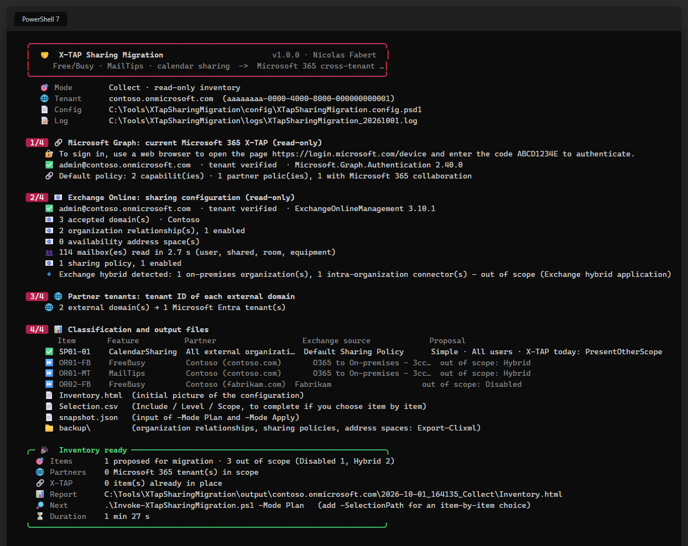

# X-TAP Sharing Migration — User guide

> What you need before the first run — the feature rolled out in **both tenants**, and the roles of **both administrators** — then one command per step, from the first inventory to the cutover: **what do we share today?**, **which partner is behind which domain?**, **what would X-TAP look like?**, **create the groups and the trusts**, **write the capabilities**, **disable the old objects with the partner**. The principles, every rule of the configuration, `Selection.csv`, the report tabs, the browser captures and the internals are in the [developer guide](XTapSharingMigration-Guide.md).

> [!IMPORTANT]
> Files downloaded from the Internet may be blocked by Windows and fail to run. Before using this project, unblock every file in the downloaded folder:
>
> ```powershell
> Get-ChildItem "C:\Chemin\Du\Dossier" -Recurse -File -Force | Unblock-File
> ```
>
> Replace the example path with the folder where you downloaded or extracted this project.
>
> The `Install-Module` commands in this documentation use `-Force`, so they also update or reinstall a module that is already installed. If an older version still conflicts, close every PowerShell window, open a new one (as administrator for `-Scope AllUsers`), run `Uninstall-Module <ModuleName> -AllVersions -Force`, then run the `Install-Module` command again.

```cards
checklist | Prerequisites | Chapter 1: the modules, the roles, the two tenants and the two administrators.
download | One-time setup | Chapter 2: copy the tool, fill in the tenant, run the first inventory.
terminal | Everyday use | Chapter 3: inventory, partners, plan, the two phases, the cutover.
chart | Results | Chapter 4: the reports, the files of a run, the exit codes.
```

# Part I · Start here

<!-- icon: checklist -->
## 1. Prerequisites

### 1.1 Your workstation

| Item | Requirement |
|---|---|
| PowerShell | **7.4** or later |
| Modules | `Microsoft.Graph.Authentication` 2.25 or later, `ExchangeOnlineManagement` 3.9 or later (not 3.10.0 in certificate mode). `ExchangeOnlineManagement` is used by **Collect** only: an administrator who runs only Plan or Apply — the Entra administrator, typically — needs just `Microsoft.Graph.Authentication`. |
| Console | Windows Terminal (colours and icons); any PowerShell console works |
| Network | `graph.microsoft.com`, `login.microsoftonline.com`, `outlook.office365.com` |

```powershell
Install-Module Microsoft.Graph.Authentication -Scope CurrentUser -Force
Install-Module ExchangeOnlineManagement -MinimumVersion 3.10.1 -Scope CurrentUser -Force
```

### 1.2 Your roles

| Run | Microsoft Entra / Exchange role | Delegated Microsoft Graph permissions |
|---|---|---|
| `Collect` | Exchange: a role that can run the `Get-` cmdlets (View-Only Organization Management, Global Reader, Exchange Administrator) | `Policy.Read.All`, `CrossTenantInformation.ReadBasic.All`, `Group.Read.All` |
| `Plan` | any of the roles below, read-only use | `Policy.Read.All`, `Group.Read.All` |
| `Apply -Phase Entra` | **Security Administrator** or Global Administrator, and **Groups Administrator** when groups are created | `Policy.ReadWrite.CrossTenantAccess`, `Group.ReadWrite.All` (or `Group.Read.All` when no group is created) |
| `Apply -Phase Exchange` | **Exchange Administrator** or Global Administrator | `Policy.ReadWrite.CrossTenantCapability`, `Group.Read.All` |

The first sign-in asks for consent to these permissions for the **Microsoft Graph Command Line Tools** application (or your own application, `Authentication.GraphClientId`).

### 1.3 Both tenants

Microsoft rolls out the X-TAP capabilities feature by feature and cloud by cloud, and asks to migrate only **after** the rollout has completed in the environment of **both** tenants. Schedule published by the Exchange team (worldwide environment, blog post updated 29 September 2026):

| Feature | Rollout begins | Expected completion |
|---|---|---|
| Free/Busy | August 2026 | 23 September 2026 |
| MailTips | August 2026 | 29 September 2026 |
| Calendar sharing | August 2026 | 15 October 2026 |

GCC, GCC High and DoD: rollout paused at the time of writing. Check the current status in Message Center (**MC1446796**). A feature that is not yet available: leave it out with `-Feature` (3.3) and migrate it later.

> [!NOTE]
> Not ready in time? Microsoft's safety valve is `EWSEnabled = $true` on the organization, which keeps the old cross-tenant path working until the final EWS shutdown (**1 April 2027**). For two-way sharing, **both** organizations need it.

### 1.4 Both administrators

The two phases can be run by different people, on different days, from the **same Collect** — or together with `-Phase All` by a Global Administrator.

| Item | What it means for you |
|---|---|
| Entra administrator | Security Administrator (+ Groups Administrator). No Exchange role and no `ExchangeOnlineManagement` module: Plan and Apply read the snapshot and Microsoft Graph, never Exchange Online. |
| Exchange administrator | Runs Collect and Plan, then `Apply -Phase Exchange`. |
| Same reference | Give `-SnapshotPath` to both. Without it, each run takes the **most recent** Collect of the tenant in its own `output` folder. |
| Same choices | Same configuration, same `-SelectionPath`, same `-Feature`. |
| Accounts | `Authentication.ExchangeAdmin` and `Authentication.EntraAdmin` in the configuration, or `-UserPrincipalName` for one run. The tool stops if another account — or another tenant — signs in. |
| Order | Entra, then Exchange. Run first, the Exchange phase applies only what needs nothing new; the others are **Blocked** and the exit code is `2`. Run it again after the Entra phase. |

What to hand over and what each one runs: [developer guide, chapter 8 — Two administrators](XTapSharingMigration-Guide.md#two-administrators).

<!-- icon: download -->
## 2. One-time setup

```steps
Copy the tool | Unblock the files (box above), then clone the repository — or download the zip of a [release](https://github.com/Nico77600/XTapSharingMigration/releases): it contains the same run-time files, with the HTML guides.
Fill in the tenant | `notepad .\config\XTapSharingMigration.config.psd1`: `Tenant.TenantId` and `Tenant.Organization` (`xxx.onmicrosoft.com`). After every sign-in, the tool stops if it is connected to another tenant.
Name the administrators | Optional: `Authentication.ExchangeAdmin` and `Authentication.EntraAdmin`, when the two phases belong to two people (1.4).
First inventory | `.\Invoke-XTapSharingMigration.ps1` — read-only, nothing is changed.
```

```powershell
git clone https://github.com/Nico77600/XTapSharingMigration.git
cd XTapSharingMigration\package
notepad .\config\XTapSharingMigration.config.psd1    # Tenant.TenantId, Tenant.Organization
.\Invoke-XTapSharingMigration.ps1                     # first inventory
```

Everything else has a usable default: the features are all migrated with the level and the scope found in Exchange Online, nothing is replaced, nothing is deleted. The rules to change that — `Features`, `Partners`, `Groups`, `Entra`, `Apply` — are in the [developer guide, chapter 7](XTapSharingMigration-Guide.md#7-configuration).

> [!IMPORTANT]
> The tool **never changes an Exchange Online object** and **never deletes** anything. Organization relationships, sharing policies and availability address spaces keep working — and keep taking precedence over X-TAP — until you run the cutover commands yourself, in a window agreed with each partner.

# Part II · Everyday use

<!-- icon: terminal -->
## 3. From inventory to cutover

```flow
search | Collect | read-only inventory
arrow | review | config or CSV
target | Plan | target vs tenant
arrow | phase 1 | Entra admin
key | Apply · Entra | groups, trusts
arrow | phase 2 | Exchange admin
mail | Apply · Exchange | capabilities
arrow | manual | with each partner
undo | Cutover | old objects off
```

Run the commands from the `package` folder, in PowerShell 7. Every run writes into `output\<tenant>\<date>_<mode>`; Plan and Apply use the most recent Collect of the tenant unless `-SnapshotPath` is given.

### 3.1 Inventory

**Do:** run the tool with no parameter, as the Exchange administrator. Two sign-ins: Microsoft Graph, then Exchange Online.

```powershell
.\Invoke-XTapSharingMigration.ps1
```

**You should see:** the steps in the console, then the run folder with `Inventory.html`, `snapshot.json`, `Selection.csv`, `PartnersToConfirm.txt`, `SharingPolicyMailboxes.csv` and `backup\*.xml`. Open `Inventory.html`: this is the **initial picture** of the tenant — keep it with the change record.



Each item is one feature of one Exchange object for one partner tenant, in scope or out of scope **with its reason**. Exchange **hybrid** objects and partners on **Exchange Server** are listed and never configured.

### 3.2 Confirm the partner tenant IDs

**Do:** send each partner the line that concerns it in `PartnersToConfirm.txt` — the tenant ID found and your own — and paste the answer in the configuration:

```powershell
Partners = @(
    @{ Name = 'Fabrikam'; Match = 'fabrikam.com'; TenantId = 'bbbbbbbb-0000-4000-8000-000000000002' }
)
```

**You should see:** a partner whose tenant ID is not confirmed stays **Blocked** in the plan, and no trust is created for it. A domain that belongs to another tenant than the one given by the partner is a **Mismatch**: check with the partner before going further.


The exchange of tenant IDs is also the moment to agree on the **cutover window**: X-TAP is inbound, so each partner configures access for **your** tenant ID on its side, and both of you disable the old objects at the same time.

### 3.3 Decide what to migrate

Accept the proposal, or adjust the `Features`, `Partners` and `Groups` rules of the configuration, or complete `Selection.csv` of the run — one row per item, with `Include`, `Level` and `Scope`:

```powershell
.\Invoke-XTapSharingMigration.ps1 -Mode Plan -SelectionPath .\output\contoso.onmicrosoft.com\2026-10-01_101500_Collect\Selection.csv
```

A run of Plan or Apply can also be limited to some features — `FreeBusy`, `MailTips`, `CalendarSharing`, `AnonymousCalendarSharing` — while the others are not yet rolled out (1.3):

```powershell
.\Invoke-XTapSharingMigration.ps1 -Mode Plan  -Feature FreeBusy, MailTips
.\Invoke-XTapSharingMigration.ps1 -Mode Apply -Phase Entra    -Feature FreeBusy, MailTips
.\Invoke-XTapSharingMigration.ps1 -Mode Apply -Phase Exchange -Feature FreeBusy, MailTips
```

Use the **same** `-Feature` for Plan and both Apply phases. Every column of `Selection.csv` and every rule: [developer guide, chapters 7 and 9](XTapSharingMigration-Guide.md#9-choosing-item-by-item--selectioncsv).

### 3.4 Plan

**Do:** compare the target with the tenant. Nothing is changed.

```powershell
.\Invoke-XTapSharingMigration.ps1 -Mode Plan
```

**You should see:** one table per phase in the console, and `Plan.html` with the actions, the target configuration, the decision of each item and the manual cutover commands. Check every **Blocked** and every **Conflict**, and run Plan again after each change of the configuration.


### 3.5 Apply — phase Entra

**Do:** create the security groups and the Microsoft 365 collaboration trust of each partner, as the Entra administrator.

```powershell
.\Invoke-XTapSharingMigration.ps1 -Mode Apply -Phase Entra
```

Type `YES` (any case) to confirm: any other answer cancels the run and changes nothing.

**You should see:** `Result.html` with what was created, verified by reading the tenant again. **Phase Entra - nothing to change** is normal when only Anonymous and `*` sharing entries are migrated for All users, or when the trusts and groups already exist: the summary gives the reason (*Why*) and the next command.

### 3.6 Apply — phase Exchange

**Do:** write the Free/Busy, MailTips and calendar sharing capabilities, as the Exchange administrator.

```powershell
.\Invoke-XTapSharingMigration.ps1 -Mode Apply -Phase Exchange
```

**You should see:** the capabilities created or already in place. A capability that needs a group or a trust not yet created is **Blocked** — *run -Phase Entra first* — with the exit code `2`: run the Entra phase, then this one again. What is already in place shows **No change**, so any phase can be run again at any time.

`-Phase All` runs both phases in one execution, for a Global Administrator.

### 3.7 Cut over with each partner

When Apply is finished, X-TAP is **configured but not used**: the old objects take precedence over it. The cutover is manual, in a window agreed with the partner, and both sides run their commands in the same window.

```steps
Pre-checks | `-Mode Plan` shows **No change** for every action; the scope groups have their members; the partner confirms its side; the baseline tests are done and kept.
Cutover | Run the commands of `ManualCutover.txt` (the **Manual cutover** tab of the report gives the same), and note the time of each one.
Tests | The test matrix of the [developer guide, chapter 11](XTapSharingMigration-Guide.md#11-after-the-script--partner-window-cutover-tests): Free/Busy in and out of the scope, MailTips with an automatic reply, calendar sharing, a partner not migrated.
GO or rollback | Every test gives the baseline result: **GO**. Otherwise run the **rollback** commands of the same file: the old path takes precedence again, and X-TAP stays configured for the next attempt.
```

| Object | Cutover | Rollback |
|---|---|---|
| Organization relationship | `Set-OrganizationRelationship -Enabled $false` | `-Enabled $true` |
| Sharing policy | `Set-SharingPolicy -Domains <entries not migrated>`, or `-Enabled $false` when nothing remains | `Set-SharingPolicy -Domains <original entries>` (+ `-Enabled $true`) |
| Availability address space | `Export-Clixml`, then `Remove-AvailabilityAddressSpace` — only once the partner has configured its side | `Add-AvailabilityAddressSpace` from the export |


> [!WARNING]
> Test MailTips with a user whose automatic reply is **on**: MailTips out of scope are silent — no error, no tip — and look exactly like "no automatic reply". Always compare with the baseline taken before the cutover.

### 3.8 Clean up

**Do not remove the old objects in the cutover window.** Remove them only after a stable period agreed with the partner. Then run the **cleanup** commands of `ManualCutover.txt` — `Remove-OrganizationRelationship`, and `Remove-SharingPolicy` for a policy left with no entry (never the default policy) — and run `Collect` again: the new inventory is the closing picture of the change.

<!-- icon: chart -->
## 4. Results

Each run writes one self-contained HTML file — no external resource, so it can be sent by mail or opened from OneDrive. Light and dark themes, search and filters on every table, details on click.

| Report | Written by | Tabs |
|---|---|---|
| **Inventory.html** | Collect | Migration items · Partners · Exchange Online · X-TAP today · Next steps |
| **Plan.html** | Plan | Actions · Target configuration · Items · Exchange Online · X-TAP today · Manual cutover · Settings used |
| **Result.html** | Apply | The same tabs; each action shows **Done / Failed / Skipped** and **Verified** |

| Operation | Meaning |
|---|---|
| **Create** / **Update** / **Add members** | The change to make (Plan) or made (Apply) |
| **No change** | Already in place |
| **Conflict** | An existing setting differs and is kept |
| **Blocked** | Cannot be done: partner not confirmed, group missing, other phase not done — the detail says what to do |
| **Other phase** | Belongs to the phase not run now |

| File of the run | Content |
|---|---|
| `Selection.csv` | One row per item, to choose item by item (3.3) |
| `PartnersToConfirm.txt` | One line per partner, ready to send (3.2) |
| `ManualCutover.txt` | The cutover, rollback and cleanup commands (3.7, 3.8) |
| `snapshot.json` | Everything Collect read and the classification — input of Plan and Apply |
| `backup\*.xml` | Raw Exchange objects (`Export-Clixml`) |
| `logs\XTapSharingMigration_<date>.log` | Every line of the console, without colours, plus the Graph calls |

| Exit code | Meaning |
|---|---|
| `0` | Success |
| `1` | Failure (error, or an action failed) |
| `2` | Finished with points to look at: blocked items, skipped or unverified actions, Apply cancelled at the confirmation, Graph not read during Collect |

# Part III · Troubleshoot

<!-- icon: lifebuoy -->
## 5. If something does not work

| Symptom | Cause and what to do |
|---|---|
| `A window handle must be configured` | Interactive Graph sign-in from a host without a console window. Run from Windows Terminal, or set `Authentication.Mode = 'DeviceCode'`. |
| `Microsoft Graph is connected to tenant …` | Wrong account or wrong tenant: sign out, or set `Authentication.ExchangeAdmin` / `EntraAdmin`. |
| `No Collect run found for this tenant` | Plan or Apply on another computer, or another `Output.Path`: copy the Collect folder and give `-SnapshotPath` (1.4). |
| `0 item(s) migrated` — *No change made* | Step 2 of Plan / Apply and the summary give the reason for every item. A relationship or a sharing policy **disabled** in Exchange Online is out of scope: re-enable it and collect again, or force it in `Selection.csv` (3.3). Hybrid and on-premises items cannot be forced. |
| *Cancelled (answer …, YES expected)* | Any answer other than `YES` cancels the Apply: nothing is changed, exit code `2`. Run again and type `YES`, or add `-Force`. |
| **Phase Entra - nothing to change** | Read the *Why* line: *not needed* (only default-policy capabilities for All users — run `-Phase Exchange`), *already in place*, or no item migrated. Exit code `0`. |
| Partner **Blocked**: tenant ID not confirmed | Add the `Partners` entry with the `TenantId` confirmed by the partner (3.2). |
| Capability **Blocked**: run -Phase Entra first | The trust or a group is not created yet: run the Entra phase, then this one again (3.5). |
| Item **Blocked**: several levels of … found | Answer the question of an interactive Plan or Apply, or set the level in `Selection.csv` or a `Partners` rule. |
| Availability address space not configured | Normal: the **partner** configures the X-TAP equivalent in its own tenant, for your tenant ID. |
| Free/Busy grey after the cutover | Allow time for caches; check that the target user has a licensed Exchange Online mailbox and is in the scope group; test with the full SMTP address. |
| Free/Busy **Unknown**, `responseCode 5016` | The user is not in the scope of the capability: check the scope group and its members. |
| `GetSchedule is not supported for domain … 62382`, `responseCode 7002` | Exchange Online does not serve this domain through X-TAP for this pair of tenants at the time of the test. Check the rollout in both tenants (1.3), the capability and its scope, the old objects on both sides; wait and test again. |
| MailTips: no automatic reply shown, no error | MailTips out of scope are silent: check the scope with a user whose automatic reply is on. |
| Calendar share: `ErrorNotAllowedExternalSharingByPolicy` | The share is refused: calendar sharing not yet available through X-TAP in this tenant (1.3), or neither the capability nor the sharing policy allows it. |

Anything else — including what the browser developer tools show for each feature, with the real captures: [developer guide, Annex A](XTapSharingMigration-Guide.md#annex-a--troubleshooting) and [chapter 11](XTapSharingMigration-Guide.md#11-after-the-script--partner-window-cutover-tests).
